# Microfrontend Architecture Diagrams

This document contains Mermaid diagrams for the MFE Application architecture.

---

## 1. High-Level Architecture Diagram

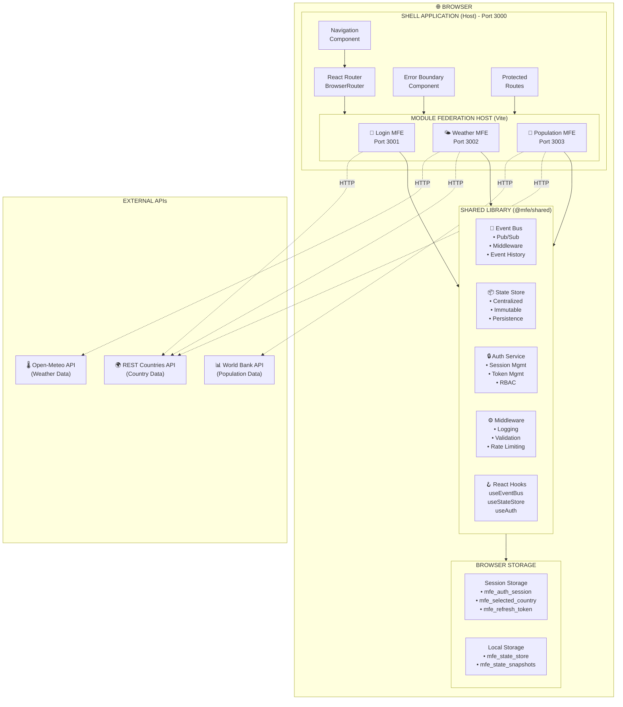
```mermaid
flowchart TB
    subgraph Browser["🌐 BROWSER"]
        subgraph Shell["SHELL APPLICATION (Host) - Port 3000"]
            Router["React Router<br/>BrowserRouter"]
            Nav["Navigation<br/>Component"]
            ErrorBound["Error Boundary<br/>Component"]
            Protected["Protected<br/>Routes"]
            
            subgraph ModFed["MODULE FEDERATION HOST (Vite)"]
                LoginMFE["🔐 Login MFE<br/>Port 3001"]
                WeatherMFE["🌤️ Weather MFE<br/>Port 3002"]
                PopulationMFE["👥 Population MFE<br/>Port 3003"]
            end
        end
        
        subgraph Shared["SHARED LIBRARY (@mfe/shared)"]
            EventBus["📡 Event Bus<br/>• Pub/Sub<br/>• Middleware<br/>• Event History"]
            StateStore["📦 State Store<br/>• Centralized<br/>• Immutable<br/>• Persistence"]
            AuthService["🔒 Auth Service<br/>• Session Mgmt<br/>• Token Mgmt<br/>• RBAC"]
            Middleware["⚙️ Middleware<br/>• Logging<br/>• Validation<br/>• Rate Limiting"]
            Hooks["🪝 React Hooks<br/>useEventBus<br/>useStateStore<br/>useAuth"]
        end
        
        subgraph Storage["BROWSER STORAGE"]
            SessionStorage["Session Storage<br/>• mfe_auth_session<br/>• mfe_selected_country<br/>• mfe_refresh_token"]
            LocalStorage["Local Storage<br/>• mfe_state_store<br/>• mfe_state_snapshots"]
        end
    end
    
    subgraph APIs["EXTERNAL APIs"]
        RestCountries["🌍 REST Countries API<br/>(Country Data)"]
        OpenMeteo["🌡️ Open-Meteo API<br/>(Weather Data)"]
        WorldBank["📊 World Bank API<br/>(Population Data)"]
    end
    
    Router --> ModFed
    Nav --> Router
    ErrorBound --> ModFed
    Protected --> ModFed
    
    LoginMFE --> Shared
    WeatherMFE --> Shared
    PopulationMFE --> Shared
    
    Shared --> Storage
    
    WeatherMFE -.->|HTTP| OpenMeteo
    WeatherMFE -.->|HTTP| RestCountries
    PopulationMFE -.->|HTTP| WorldBank
    PopulationMFE -.->|HTTP| RestCountries
    LoginMFE -.->|HTTP| RestCountries
```

---

## 2. Component Diagram

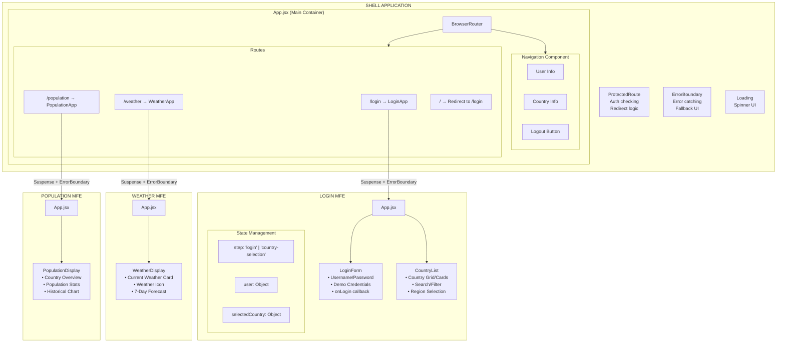
```mermaid
flowchart TB
    subgraph ShellApp["SHELL APPLICATION"]
        subgraph AppJsx["App.jsx (Main Container)"]
            BrowserRouter["BrowserRouter"]
            
            subgraph NavComponent["Navigation Component"]
                UserInfo["User Info"]
                CountryInfo["Country Info"]
                LogoutBtn["Logout Button"]
            end
            
            subgraph Routes["Routes"]
                LoginRoute["/login → LoginApp"]
                WeatherRoute["/weather → WeatherApp"]
                PopRoute["/population → PopulationApp"]
                DefaultRoute["/ → Redirect to /login"]
            end
        end
        
        ProtectedRoute["ProtectedRoute<br/>Auth checking<br/>Redirect logic"]
        ErrorBoundary["ErrorBoundary<br/>Error catching<br/>Fallback UI"]
        Loading["Loading<br/>Spinner UI"]
    end
    
    subgraph LoginMFE["LOGIN MFE"]
        LoginAppJsx["App.jsx"]
        
        subgraph LoginState["State Management"]
            Step["step: 'login' | 'country-selection'"]
            User["user: Object"]
            SelectedCountry["selectedCountry: Object"]
        end
        
        LoginForm["LoginForm<br/>• Username/Password<br/>• Demo Credentials<br/>• onLogin callback"]
        CountryList["CountryList<br/>• Country Grid/Cards<br/>• Search/Filter<br/>• Region Selection"]
    end
    
    subgraph WeatherMFE["WEATHER MFE"]
        WeatherAppJsx["App.jsx"]
        WeatherDisplay["WeatherDisplay<br/>• Current Weather Card<br/>• Weather Icon<br/>• 7-Day Forecast"]
    end
    
    subgraph PopMFE["POPULATION MFE"]
        PopAppJsx["App.jsx"]
        PopDisplay["PopulationDisplay<br/>• Country Overview<br/>• Population Stats<br/>• Historical Chart"]
    end
    
    BrowserRouter --> NavComponent
    BrowserRouter --> Routes
    
    LoginRoute -->|Suspense + ErrorBoundary| LoginAppJsx
    WeatherRoute -->|Suspense + ErrorBoundary| WeatherAppJsx
    PopRoute -->|Suspense + ErrorBoundary| PopAppJsx
    
    LoginAppJsx --> LoginForm
    LoginAppJsx --> CountryList
    WeatherAppJsx --> WeatherDisplay
    PopAppJsx --> PopDisplay
```

---

## 3. Login Flow Sequence Diagram

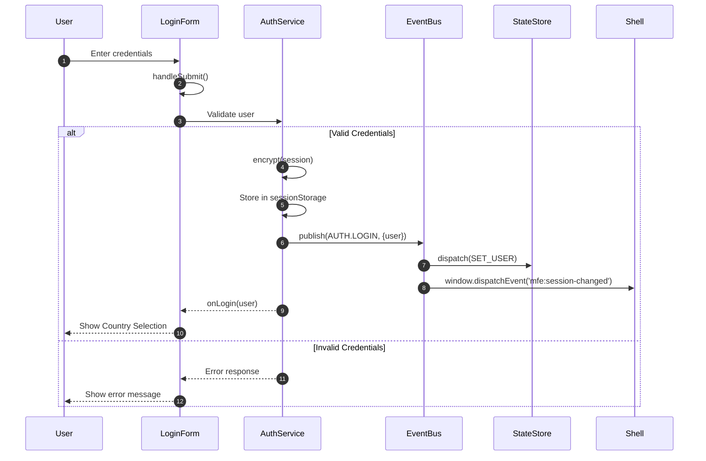
```mermaid
sequenceDiagram
    autonumber
    participant User
    participant LoginForm
    participant AuthService
    participant EventBus
    participant StateStore
    participant Shell
    
    User->>LoginForm: Enter credentials
    LoginForm->>LoginForm: handleSubmit()
    LoginForm->>AuthService: Validate user
    
    alt Valid Credentials
        AuthService->>AuthService: encrypt(session)
        AuthService->>AuthService: Store in sessionStorage
        AuthService->>EventBus: publish(AUTH.LOGIN, {user})
        EventBus->>StateStore: dispatch(SET_USER)
        EventBus->>Shell: window.dispatchEvent('mfe:session-changed')
        AuthService-->>LoginForm: onLogin(user)
        LoginForm-->>User: Show Country Selection
    else Invalid Credentials
        AuthService-->>LoginForm: Error response
        LoginForm-->>User: Show error message
    end
```

---

## 4. Country Selection & Navigation Flow

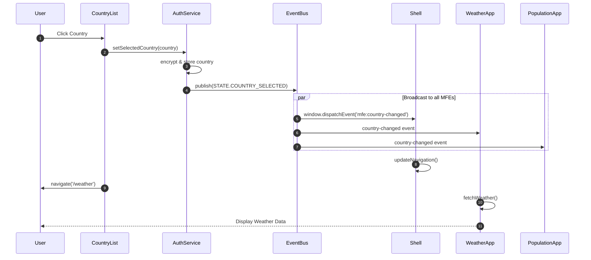
```mermaid
sequenceDiagram
    autonumber
    participant User
    participant CountryList
    participant AuthService
    participant EventBus
    participant Shell
    participant WeatherApp
    participant PopulationApp
    
    User->>CountryList: Click Country
    CountryList->>AuthService: setSelectedCountry(country)
    AuthService->>AuthService: encrypt & store country
    AuthService->>EventBus: publish(STATE.COUNTRY_SELECTED)
    
    par Broadcast to all MFEs
        EventBus->>Shell: window.dispatchEvent('mfe:country-changed')
        EventBus->>WeatherApp: country-changed event
        EventBus->>PopulationApp: country-changed event
    end
    
    Shell->>Shell: updateNavigation()
    CountryList->>User: navigate('/weather')
    
    WeatherApp->>WeatherApp: fetchWeather()
    WeatherApp-->>User: Display Weather Data
```

---

## 5. Event Bus Communication Pattern

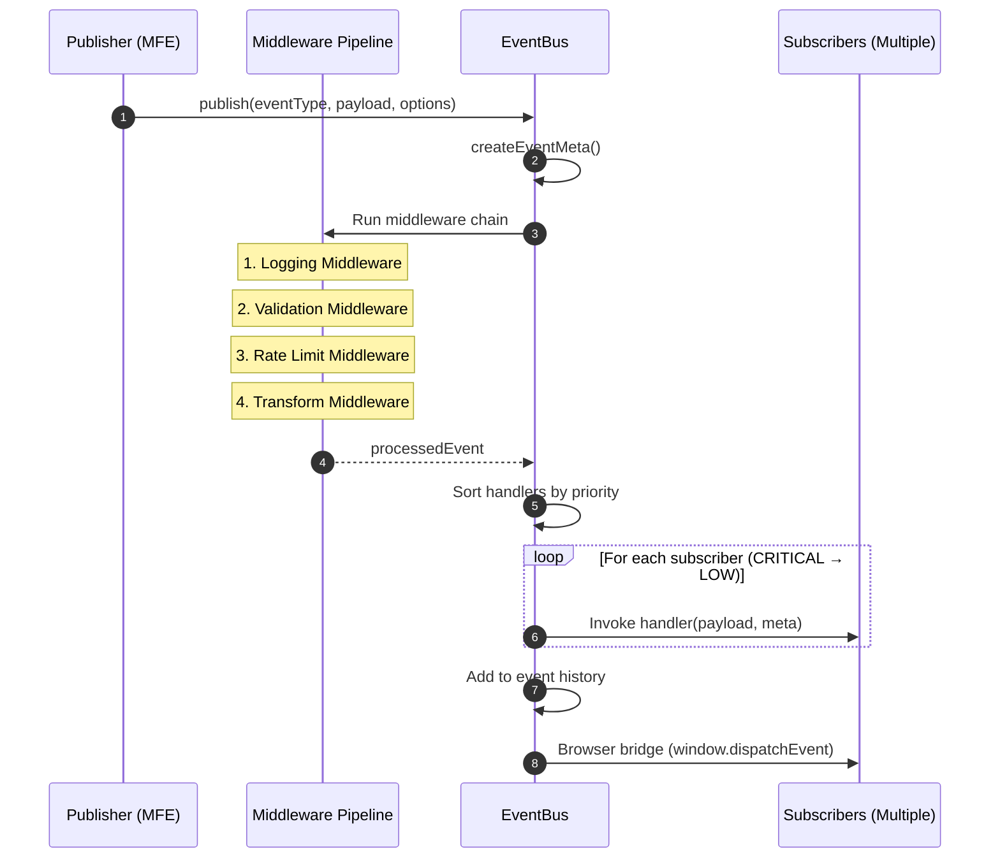
```mermaid
sequenceDiagram
    autonumber
    participant Publisher as Publisher (MFE)
    participant Middleware as Middleware Pipeline
    participant EventBus
    participant Subscribers as Subscribers (Multiple)
    
    Publisher->>EventBus: publish(eventType, payload, options)
    EventBus->>EventBus: createEventMeta()
    
    EventBus->>Middleware: Run middleware chain
    
    Note over Middleware: 1. Logging Middleware
    Note over Middleware: 2. Validation Middleware
    Note over Middleware: 3. Rate Limit Middleware
    Note over Middleware: 4. Transform Middleware
    
    Middleware-->>EventBus: processedEvent
    
    EventBus->>EventBus: Sort handlers by priority
    
    loop For each subscriber (CRITICAL → LOW)
        EventBus->>Subscribers: Invoke handler(payload, meta)
    end
    
    EventBus->>EventBus: Add to event history
    EventBus->>Subscribers: Browser bridge (window.dispatchEvent)
```

---

## 6. Data Flow Diagram

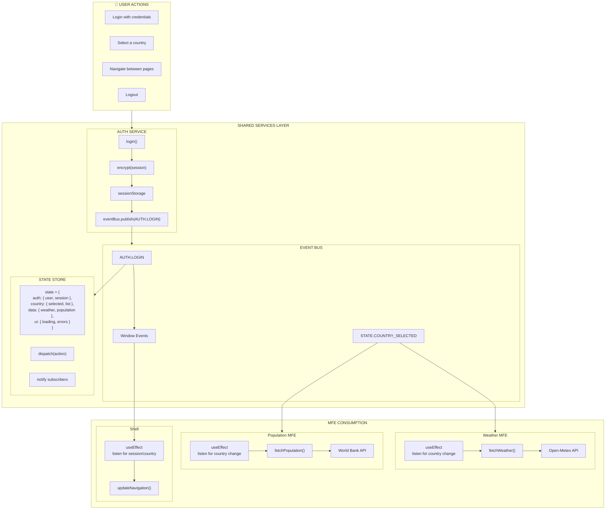
```mermaid
flowchart TB
    subgraph UserActions["👤 USER ACTIONS"]
        Login["Login with credentials"]
        SelectCountry["Select a country"]
        Navigate["Navigate between pages"]
        Logout["Logout"]
    end
    
    subgraph SharedServices["SHARED SERVICES LAYER"]
        subgraph AuthSvc["AUTH SERVICE"]
            LoginFn["login()"]
            Encrypt["encrypt(session)"]
            Store["sessionStorage"]
            PublishAuth["eventBus.publish(AUTH.LOGIN)"]
        end
        
        subgraph EvtBus["EVENT BUS"]
            AuthLogin["AUTH.LOGIN"]
            CountrySelected["STATE.COUNTRY_SELECTED"]
            WindowEvent["Window Events"]
        end
        
        subgraph StateSt["STATE STORE"]
            State["state = {<br/>auth: { user, session },<br/>country: { selected, list },<br/>data: { weather, population },<br/>ui: { loading, errors }<br/>}"]
            Dispatch["dispatch(action)"]
            Notify["notify subscribers"]
        end
    end
    
    subgraph MFEConsumption["MFE CONSUMPTION"]
        subgraph Weather["Weather MFE"]
            WeatherEffect["useEffect<br/>listen for country change"]
            FetchWeather["fetchWeather()"]
            OpenMeteoAPI["Open-Meteo API"]
        end
        
        subgraph Population["Population MFE"]
            PopEffect["useEffect<br/>listen for country change"]
            FetchPop["fetchPopulation()"]
            WorldBankAPI["World Bank API"]
        end
        
        subgraph ShellMFE["Shell"]
            ShellEffect["useEffect<br/>listen for session/country"]
            UpdateNav["updateNavigation()"]
        end
    end
    
    UserActions --> AuthSvc
    LoginFn --> Encrypt --> Store --> PublishAuth
    PublishAuth --> EvtBus
    
    AuthLogin --> StateSt
    AuthLogin --> WindowEvent
    CountrySelected --> Weather
    CountrySelected --> Population
    
    WeatherEffect --> FetchWeather --> OpenMeteoAPI
    PopEffect --> FetchPop --> WorldBankAPI
    WindowEvent --> ShellEffect --> UpdateNav
```

---

## 7. Module Federation Architecture

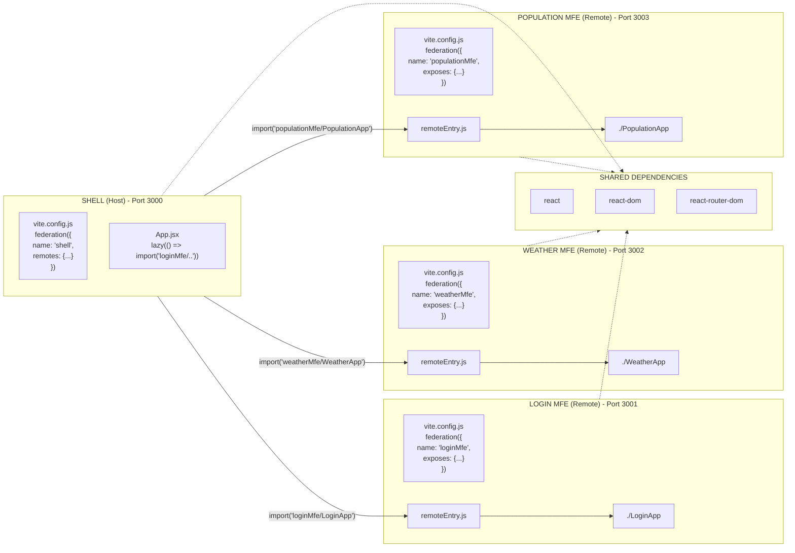
```mermaid
flowchart LR
    subgraph Host["SHELL (Host) - Port 3000"]
        HostConfig["vite.config.js<br/>federation({<br/>  name: 'shell',<br/>  remotes: {...}<br/>})"]
        HostApp["App.jsx<br/>lazy(() => import('loginMfe/..'))"]
    end
    
    subgraph Remote1["LOGIN MFE (Remote) - Port 3001"]
        Login1Config["vite.config.js<br/>federation({<br/>  name: 'loginMfe',<br/>  exposes: {...}<br/>})"]
        LoginEntry["remoteEntry.js"]
        LoginApp["./LoginApp"]
    end
    
    subgraph Remote2["WEATHER MFE (Remote) - Port 3002"]
        Weather2Config["vite.config.js<br/>federation({<br/>  name: 'weatherMfe',<br/>  exposes: {...}<br/>})"]
        WeatherEntry["remoteEntry.js"]
        WeatherApp["./WeatherApp"]
    end
    
    subgraph Remote3["POPULATION MFE (Remote) - Port 3003"]
        Pop3Config["vite.config.js<br/>federation({<br/>  name: 'populationMfe',<br/>  exposes: {...}<br/>})"]
        PopEntry["remoteEntry.js"]
        PopApp["./PopulationApp"]
    end
    
    subgraph SharedDeps["SHARED DEPENDENCIES"]
        React["react"]
        ReactDOM["react-dom"]
        ReactRouter["react-router-dom"]
    end
    
    Host -->|"import('loginMfe/LoginApp')"| LoginEntry
    Host -->|"import('weatherMfe/WeatherApp')"| WeatherEntry
    Host -->|"import('populationMfe/PopulationApp')"| PopEntry
    
    LoginEntry --> LoginApp
    WeatherEntry --> WeatherApp
    PopEntry --> PopApp
    
    Host -.-> SharedDeps
    Remote1 -.-> SharedDeps
    Remote2 -.-> SharedDeps
    Remote3 -.-> SharedDeps
```

---

## 8. State Store Architecture

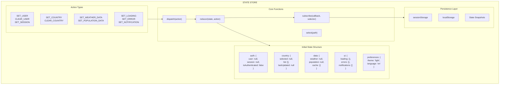
```mermaid
flowchart TB
    subgraph StateStore["STATE STORE"]
        subgraph InitialState["Initial State Structure"]
            Auth["auth: {<br/>user: null,<br/>session: null,<br/>isAuthenticated: false<br/>}"]
            Country["country: {<br/>selected: null,<br/>list: [],<br/>lastUpdated: null<br/>}"]
            Data["data: {<br/>weather: null,<br/>population: null,<br/>cache: {}<br/>}"]
            UI["ui: {<br/>loading: {},<br/>errors: {},<br/>notifications: []<br/>}"]
            Prefs["preferences: {<br/>theme: 'light',<br/>language: 'en'<br/>}"]
        end
        
        subgraph Actions["Action Types"]
            AuthActions["SET_USER<br/>CLEAR_USER<br/>SET_SESSION"]
            CountryActions["SET_COUNTRY<br/>CLEAR_COUNTRY"]
            DataActions["SET_WEATHER_DATA<br/>SET_POPULATION_DATA"]
            UIActions["SET_LOADING<br/>SET_ERROR<br/>SET_NOTIFICATION"]
        end
        
        subgraph Core["Core Functions"]
            Dispatch["dispatch(action)"]
            Reducer["reducer(state, action)"]
            Subscribe["subscribe(callback, selector)"]
            Select["select(path)"]
        end
        
        subgraph Persistence["Persistence Layer"]
            SessionStor["sessionStorage"]
            LocalStor["localStorage"]
            Snapshots["State Snapshots"]
        end
    end
    
    Actions --> Dispatch
    Dispatch --> Reducer
    Reducer --> InitialState
    Reducer --> Subscribe
    Subscribe --> Persistence
```

---

## 9. Authentication Flow State Machine

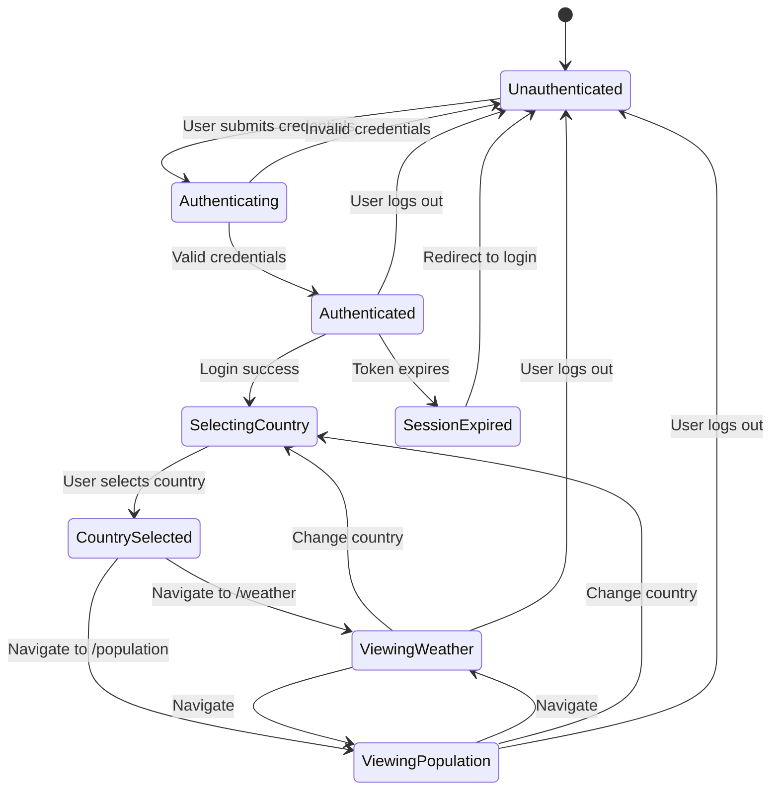
```mermaid
stateDiagram-v2
    [*] --> Unauthenticated
    
    Unauthenticated --> Authenticating: User submits credentials
    Authenticating --> Authenticated: Valid credentials
    Authenticating --> Unauthenticated: Invalid credentials
    
    Authenticated --> SelectingCountry: Login success
    SelectingCountry --> CountrySelected: User selects country
    
    CountrySelected --> ViewingWeather: Navigate to /weather
    CountrySelected --> ViewingPopulation: Navigate to /population
    
    ViewingWeather --> ViewingPopulation: Navigate
    ViewingPopulation --> ViewingWeather: Navigate
    
    ViewingWeather --> SelectingCountry: Change country
    ViewingPopulation --> SelectingCountry: Change country
    
    Authenticated --> SessionExpired: Token expires
    SessionExpired --> Unauthenticated: Redirect to login
    
    Authenticated --> Unauthenticated: User logs out
    ViewingWeather --> Unauthenticated: User logs out
    ViewingPopulation --> Unauthenticated: User logs out
```

---

## 10. Error Handling Flow

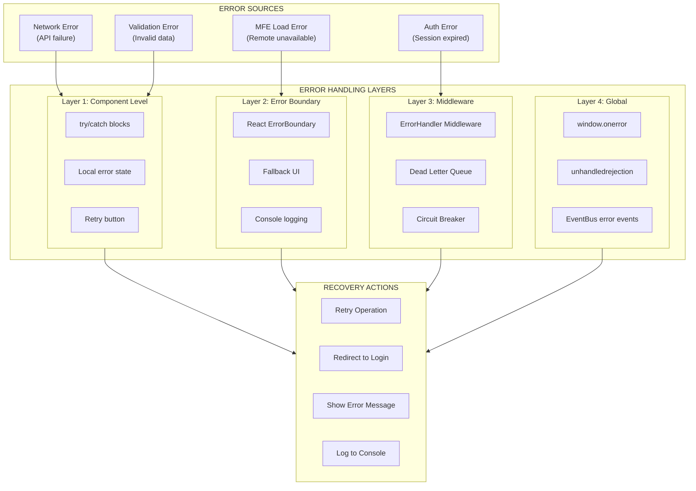
```mermaid
flowchart TB
    subgraph ErrorSources["ERROR SOURCES"]
        NetworkError["Network Error<br/>(API failure)"]
        AuthError["Auth Error<br/>(Session expired)"]
        MFEError["MFE Load Error<br/>(Remote unavailable)"]
        ValidationError["Validation Error<br/>(Invalid data)"]
    end
    
    subgraph ErrorHandling["ERROR HANDLING LAYERS"]
        subgraph Layer1["Layer 1: Component Level"]
            TryCatch["try/catch blocks"]
            LocalState["Local error state"]
            RetryBtn["Retry button"]
        end
        
        subgraph Layer2["Layer 2: Error Boundary"]
            ReactBoundary["React ErrorBoundary"]
            FallbackUI["Fallback UI"]
            ErrorLogging["Console logging"]
        end
        
        subgraph Layer3["Layer 3: Middleware"]
            ErrorMiddleware["ErrorHandler Middleware"]
            DeadLetter["Dead Letter Queue"]
            CircuitBreaker["Circuit Breaker"]
        end
        
        subgraph Layer4["Layer 4: Global"]
            WindowError["window.onerror"]
            UnhandledRejection["unhandledrejection"]
            EventBusError["EventBus error events"]
        end
    end
    
    subgraph Recovery["RECOVERY ACTIONS"]
        Retry["Retry Operation"]
        Redirect["Redirect to Login"]
        ShowError["Show Error Message"]
        LogError["Log to Console"]
    end
    
    NetworkError --> Layer1
    AuthError --> Layer3
    MFEError --> Layer2
    ValidationError --> Layer1
    
    Layer1 --> Recovery
    Layer2 --> Recovery
    Layer3 --> Recovery
    Layer4 --> Recovery
```

---

## 11. Deployment Architecture

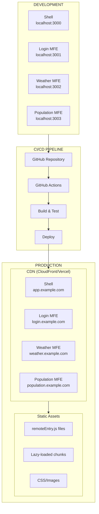
```mermaid
flowchart TB
    subgraph Development["DEVELOPMENT"]
        DevShell["Shell<br/>localhost:3000"]
        DevLogin["Login MFE<br/>localhost:3001"]
        DevWeather["Weather MFE<br/>localhost:3002"]
        DevPop["Population MFE<br/>localhost:3003"]
    end
    
    subgraph CI_CD["CI/CD PIPELINE"]
        GitHub["GitHub Repository"]
        Actions["GitHub Actions"]
        Build["Build & Test"]
        Deploy["Deploy"]
    end
    
    subgraph Production["PRODUCTION"]
        subgraph CDN["CDN (CloudFront/Vercel)"]
            ProdShell["Shell<br/>app.example.com"]
            ProdLogin["Login MFE<br/>login.example.com"]
            ProdWeather["Weather MFE<br/>weather.example.com"]
            ProdPop["Population MFE<br/>population.example.com"]
        end
        
        subgraph Static["Static Assets"]
            RemoteEntries["remoteEntry.js files"]
            Chunks["Lazy-loaded chunks"]
            Assets["CSS/Images"]
        end
    end
    
    Development --> GitHub
    GitHub --> Actions
    Actions --> Build
    Build --> Deploy
    Deploy --> CDN
    CDN --> Static
```

---

## 12. Class Diagram - Shared Library

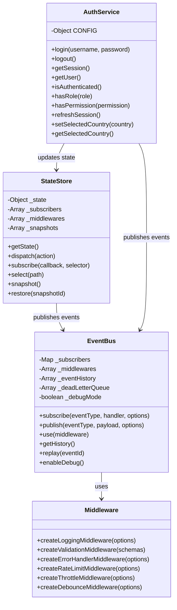
```mermaid
classDiagram
    class EventBus {
        -Map _subscribers
        -Array _middlewares
        -Array _eventHistory
        -Array _deadLetterQueue
        -boolean _debugMode
        +subscribe(eventType, handler, options)
        +publish(eventType, payload, options)
        +use(middleware)
        +getHistory()
        +replay(eventId)
        +enableDebug()
    }
    
    class StateStore {
        -Object _state
        -Array _subscribers
        -Array _middlewares
        -Array _snapshots
        +getState()
        +dispatch(action)
        +subscribe(callback, selector)
        +select(path)
        +snapshot()
        +restore(snapshotId)
    }
    
    class AuthService {
        -Object CONFIG
        +login(username, password)
        +logout()
        +getSession()
        +getUser()
        +isAuthenticated()
        +hasRole(role)
        +hasPermission(permission)
        +refreshSession()
        +setSelectedCountry(country)
        +getSelectedCountry()
    }
    
    class Middleware {
        +createLoggingMiddleware(options)
        +createValidationMiddleware(schemas)
        +createErrorHandlerMiddleware(options)
        +createRateLimitMiddleware(options)
        +createThrottleMiddleware(options)
        +createDebounceMiddleware(options)
    }
    
    EventBus --> Middleware : uses
    StateStore --> EventBus : publishes events
    AuthService --> EventBus : publishes events
    AuthService --> StateStore : updates state
```

---

## 13. C4 Model Diagrams

### C4 Level 1: System Context Diagram

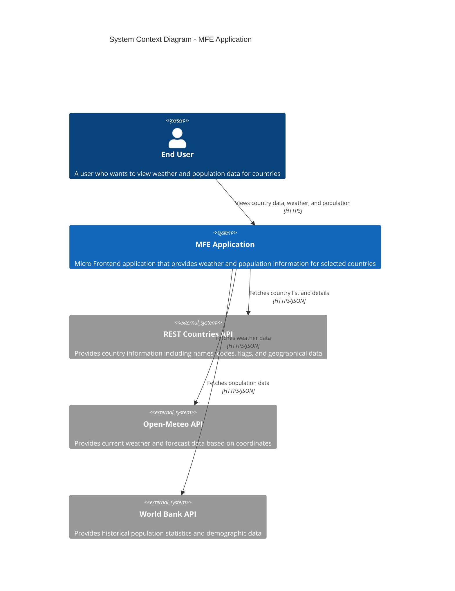
```mermaid
C4Context
    title System Context Diagram - MFE Application

    Person(user, "End User", "A user who wants to view weather and population data for countries")
    
    System(mfeApp, "MFE Application", "Micro Frontend application that provides weather and population information for selected countries")
    
    System_Ext(restCountries, "REST Countries API", "Provides country information including names, codes, flags, and geographical data")
    System_Ext(openMeteo, "Open-Meteo API", "Provides current weather and forecast data based on coordinates")
    System_Ext(worldBank, "World Bank API", "Provides historical population statistics and demographic data")
    
    Rel(user, mfeApp, "Views country data, weather, and population", "HTTPS")
    Rel(mfeApp, restCountries, "Fetches country list and details", "HTTPS/JSON")
    Rel(mfeApp, openMeteo, "Fetches weather data", "HTTPS/JSON")
    Rel(mfeApp, worldBank, "Fetches population data", "HTTPS/JSON")
```

### C4 Level 2: Container Diagram

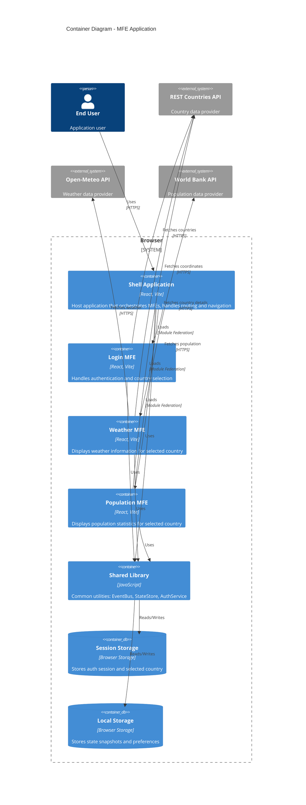
```mermaid
C4Container
    title Container Diagram - MFE Application

    Person(user, "End User", "Application user")
    
    System_Boundary(browser, "Browser") {
        Container(shell, "Shell Application", "React, Vite", "Host application that orchestrates MFEs, handles routing and navigation")
        Container(loginMfe, "Login MFE", "React, Vite", "Handles authentication and country selection")
        Container(weatherMfe, "Weather MFE", "React, Vite", "Displays weather information for selected country")
        Container(populationMfe, "Population MFE", "React, Vite", "Displays population statistics for selected country")
        Container(sharedLib, "Shared Library", "JavaScript", "Common utilities: EventBus, StateStore, AuthService")
        ContainerDb(sessionStore, "Session Storage", "Browser Storage", "Stores auth session and selected country")
        ContainerDb(localStorage, "Local Storage", "Browser Storage", "Stores state snapshots and preferences")
    }
    
    System_Ext(restCountries, "REST Countries API", "Country data provider")
    System_Ext(openMeteo, "Open-Meteo API", "Weather data provider")
    System_Ext(worldBank, "World Bank API", "Population data provider")
    
    Rel(user, shell, "Uses", "HTTPS")
    Rel(shell, loginMfe, "Loads", "Module Federation")
    Rel(shell, weatherMfe, "Loads", "Module Federation")
    Rel(shell, populationMfe, "Loads", "Module Federation")
    
    Rel(loginMfe, sharedLib, "Uses")
    Rel(weatherMfe, sharedLib, "Uses")
    Rel(populationMfe, sharedLib, "Uses")
    Rel(shell, sharedLib, "Uses")
    
    Rel(sharedLib, sessionStore, "Reads/Writes")
    Rel(sharedLib, localStorage, "Reads/Writes")
    
    Rel(loginMfe, restCountries, "Fetches countries", "HTTPS")
    Rel(weatherMfe, openMeteo, "Fetches weather", "HTTPS")
    Rel(weatherMfe, restCountries, "Fetches coordinates", "HTTPS")
    Rel(populationMfe, worldBank, "Fetches population", "HTTPS")
    Rel(populationMfe, restCountries, "Fetches country details", "HTTPS")
```

### C4 Level 3: Component Diagram - Shell Application

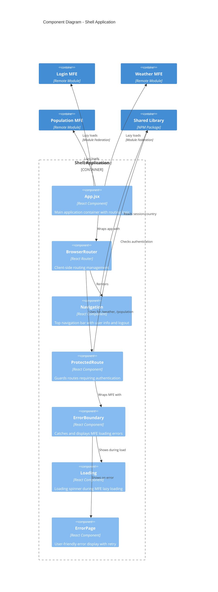
```mermaid
C4Component
    title Component Diagram - Shell Application

    Container_Boundary(shell, "Shell Application") {
        Component(appJsx, "App.jsx", "React Component", "Main application container with routing logic")
        Component(browserRouter, "BrowserRouter", "React Router", "Client-side routing management")
        Component(navigation, "Navigation", "React Component", "Top navigation bar with user info and logout")
        Component(protectedRoute, "ProtectedRoute", "React Component", "Guards routes requiring authentication")
        Component(errorBoundary, "ErrorBoundary", "React Component", "Catches and displays MFE loading errors")
        Component(loading, "Loading", "React Component", "Loading spinner during MFE lazy loading")
        Component(errorPage, "ErrorPage", "React Component", "User-friendly error display with retry")
    }
    
    Container(loginMfe, "Login MFE", "Remote Module")
    Container(weatherMfe, "Weather MFE", "Remote Module")
    Container(populationMfe, "Population MFE", "Remote Module")
    Container(sharedLib, "Shared Library", "NPM Package")
    
    Rel(appJsx, browserRouter, "Wraps app with")
    Rel(browserRouter, navigation, "Renders")
    Rel(browserRouter, protectedRoute, "Uses for /weather, /population")
    Rel(protectedRoute, errorBoundary, "Wraps MFE with")
    Rel(errorBoundary, loading, "Shows during load")
    Rel(errorBoundary, errorPage, "Shows on error")
    
    Rel(appJsx, loginMfe, "Lazy loads", "Module Federation")
    Rel(appJsx, weatherMfe, "Lazy loads", "Module Federation")
    Rel(appJsx, populationMfe, "Lazy loads", "Module Federation")
    
    Rel(navigation, sharedLib, "Reads session/country")
    Rel(protectedRoute, sharedLib, "Checks authentication")
```

### C4 Level 3: Component Diagram - Shared Library

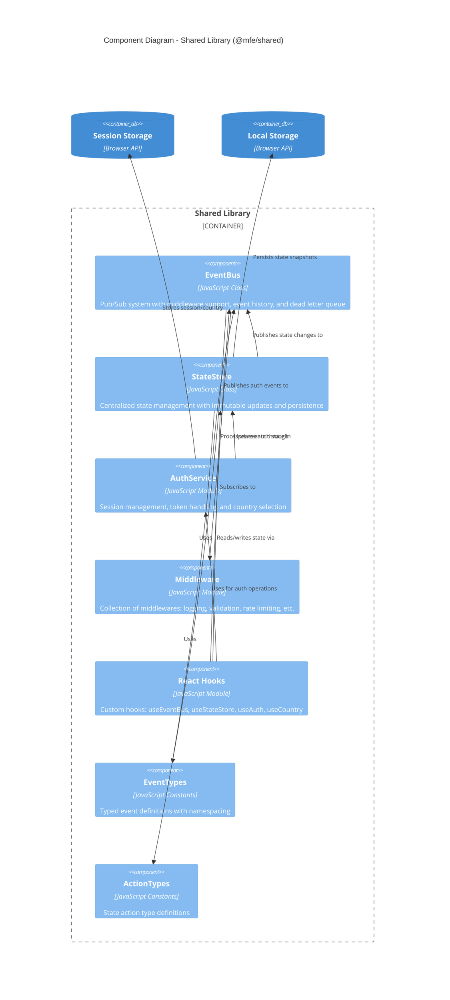
```mermaid
C4Component
    title Component Diagram - Shared Library (@mfe/shared)

    Container_Boundary(sharedLib, "Shared Library") {
        Component(eventBus, "EventBus", "JavaScript Class", "Pub/Sub system with middleware support, event history, and dead letter queue")
        Component(stateStore, "StateStore", "JavaScript Class", "Centralized state management with immutable updates and persistence")
        Component(authService, "AuthService", "JavaScript Module", "Session management, token handling, and country selection")
        Component(middleware, "Middleware", "JavaScript Module", "Collection of middlewares: logging, validation, rate limiting, etc.")
        Component(hooks, "React Hooks", "JavaScript Module", "Custom hooks: useEventBus, useStateStore, useAuth, useCountry")
        Component(eventTypes, "EventTypes", "JavaScript Constants", "Typed event definitions with namespacing")
        Component(actionTypes, "ActionTypes", "JavaScript Constants", "State action type definitions")
    }
    
    ContainerDb(sessionStorage, "Session Storage", "Browser API")
    ContainerDb(localStorage, "Local Storage", "Browser API")
    
    Rel(eventBus, middleware, "Processes events through")
    Rel(stateStore, eventBus, "Publishes state changes to")
    Rel(authService, eventBus, "Publishes auth events to")
    Rel(authService, stateStore, "Updates auth state in")
    Rel(hooks, eventBus, "Subscribes to")
    Rel(hooks, stateStore, "Reads/writes state via")
    Rel(hooks, authService, "Uses for auth operations")
    
    Rel(authService, sessionStorage, "Stores session/country")
    Rel(stateStore, localStorage, "Persists state snapshots")
    
    Rel(eventBus, eventTypes, "Uses")
    Rel(stateStore, actionTypes, "Uses")
```

### C4 Level 3: Component Diagram - Login MFE

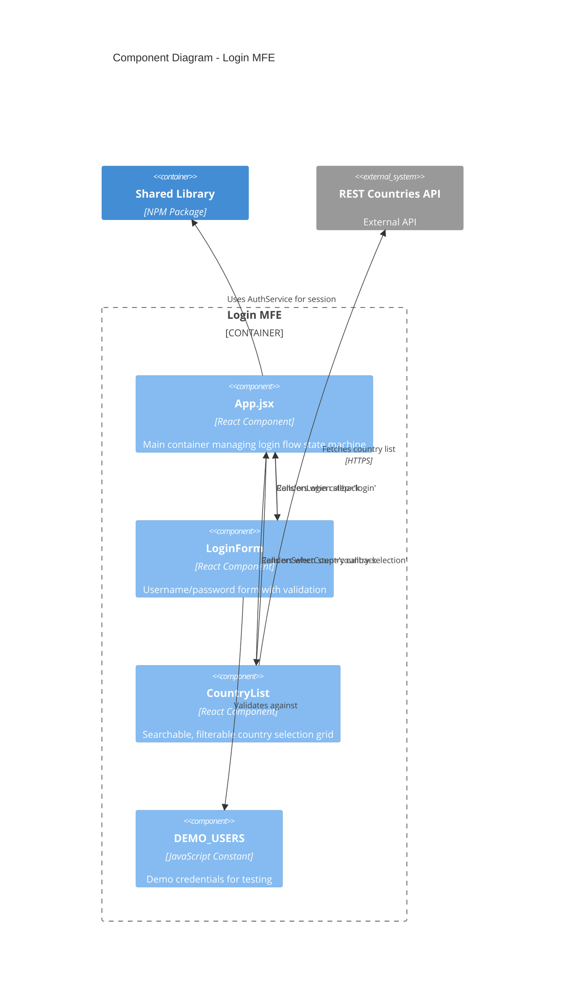
```mermaid
C4Component
    title Component Diagram - Login MFE

    Container_Boundary(loginMfe, "Login MFE") {
        Component(loginApp, "App.jsx", "React Component", "Main container managing login flow state machine")
        Component(loginForm, "LoginForm", "React Component", "Username/password form with validation")
        Component(countryList, "CountryList", "React Component", "Searchable, filterable country selection grid")
        Component(demoUsers, "DEMO_USERS", "JavaScript Constant", "Demo credentials for testing")
    }
    
    Container(sharedLib, "Shared Library", "NPM Package")
    System_Ext(restCountries, "REST Countries API", "External API")
    
    Rel(loginApp, loginForm, "Renders when step='login'")
    Rel(loginApp, countryList, "Renders when step='country-selection'")
    Rel(loginForm, demoUsers, "Validates against")
    Rel(loginForm, loginApp, "Calls onLogin callback")
    Rel(countryList, loginApp, "Calls onSelectCountry callback")
    
    Rel(loginApp, sharedLib, "Uses AuthService for session")
    Rel(countryList, restCountries, "Fetches country list", "HTTPS")
```

### C4 Level 3: Component Diagram - Weather MFE

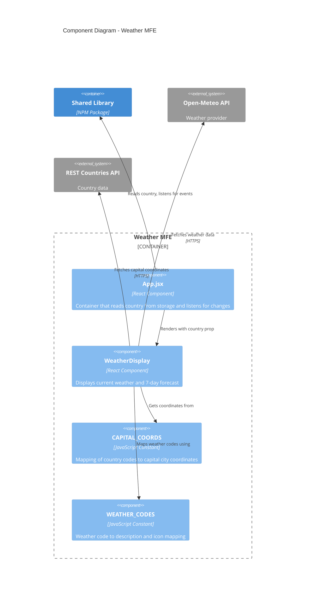
```mermaid
C4Component
    title Component Diagram - Weather MFE

    Container_Boundary(weatherMfe, "Weather MFE") {
        Component(weatherApp, "App.jsx", "React Component", "Container that reads country from storage and listens for changes")
        Component(weatherDisplay, "WeatherDisplay", "React Component", "Displays current weather and 7-day forecast")
        Component(capitalCoords, "CAPITAL_COORDS", "JavaScript Constant", "Mapping of country codes to capital city coordinates")
        Component(weatherCodes, "WEATHER_CODES", "JavaScript Constant", "Weather code to description and icon mapping")
    }
    
    Container(sharedLib, "Shared Library", "NPM Package")
    System_Ext(openMeteo, "Open-Meteo API", "Weather provider")
    System_Ext(restCountries, "REST Countries API", "Country data")
    
    Rel(weatherApp, weatherDisplay, "Renders with country prop")
    Rel(weatherApp, sharedLib, "Reads country, listens for events")
    Rel(weatherDisplay, capitalCoords, "Gets coordinates from")
    Rel(weatherDisplay, weatherCodes, "Maps weather codes using")
    Rel(weatherDisplay, openMeteo, "Fetches weather data", "HTTPS")
    Rel(weatherDisplay, restCountries, "Fetches capital coordinates", "HTTPS")
```

### C4 Level 3: Component Diagram - Population MFE

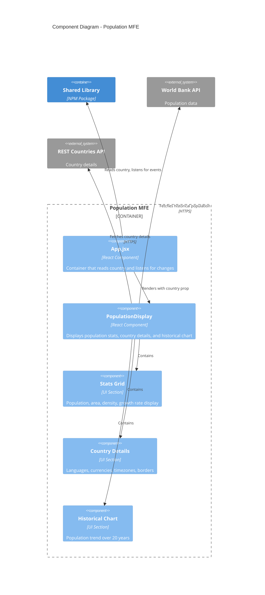
```mermaid
C4Component
    title Component Diagram - Population MFE

    Container_Boundary(populationMfe, "Population MFE") {
        Component(populationApp, "App.jsx", "React Component", "Container that reads country and listens for changes")
        Component(populationDisplay, "PopulationDisplay", "React Component", "Displays population stats, country details, and historical chart")
        Component(statsGrid, "Stats Grid", "UI Section", "Population, area, density, growth rate display")
        Component(countryDetails, "Country Details", "UI Section", "Languages, currencies, timezones, borders")
        Component(historicalChart, "Historical Chart", "UI Section", "Population trend over 20 years")
    }
    
    Container(sharedLib, "Shared Library", "NPM Package")
    System_Ext(worldBank, "World Bank API", "Population data")
    System_Ext(restCountries, "REST Countries API", "Country details")
    
    Rel(populationApp, populationDisplay, "Renders with country prop")
    Rel(populationApp, sharedLib, "Reads country, listens for events")
    Rel(populationDisplay, statsGrid, "Contains")
    Rel(populationDisplay, countryDetails, "Contains")
    Rel(populationDisplay, historicalChart, "Contains")
    Rel(populationDisplay, worldBank, "Fetches historical population", "HTTPS")
    Rel(populationDisplay, restCountries, "Fetches country details", "HTTPS")
```

---

## 14. C4 Code Level - Key Classes

### EventBus Internal Structure

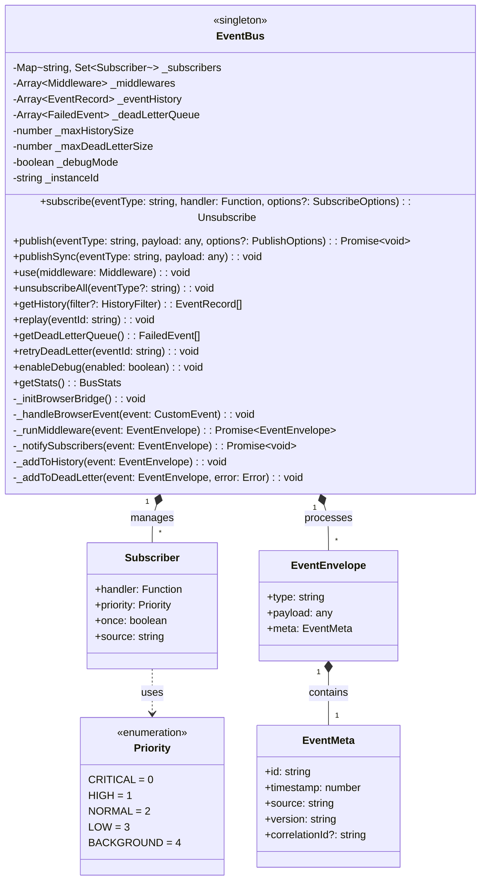
```mermaid
classDiagram
    class EventBus {
        <<singleton>>
        -Map~string, Set~Subscriber~~ _subscribers
        -Array~Middleware~ _middlewares
        -Array~EventRecord~ _eventHistory
        -Array~FailedEvent~ _deadLetterQueue
        -number _maxHistorySize
        -number _maxDeadLetterSize
        -boolean _debugMode
        -string _instanceId
        
        +subscribe(eventType: string, handler: Function, options?: SubscribeOptions): Unsubscribe
        +publish(eventType: string, payload: any, options?: PublishOptions): Promise~void~
        +publishSync(eventType: string, payload: any): void
        +use(middleware: Middleware): void
        +unsubscribeAll(eventType?: string): void
        +getHistory(filter?: HistoryFilter): EventRecord[]
        +replay(eventId: string): void
        +getDeadLetterQueue(): FailedEvent[]
        +retryDeadLetter(eventId: string): void
        +enableDebug(enabled: boolean): void
        +getStats(): BusStats
        
        -_initBrowserBridge(): void
        -_handleBrowserEvent(event: CustomEvent): void
        -_runMiddleware(event: EventEnvelope): Promise~EventEnvelope~
        -_notifySubscribers(event: EventEnvelope): Promise~void~
        -_addToHistory(event: EventEnvelope): void
        -_addToDeadLetter(event: EventEnvelope, error: Error): void
    }
    
    class Subscriber {
        +handler: Function
        +priority: Priority
        +once: boolean
        +source: string
    }
    
    class EventEnvelope {
        +type: string
        +payload: any
        +meta: EventMeta
    }
    
    class EventMeta {
        +id: string
        +timestamp: number
        +source: string
        +version: string
        +correlationId?: string
    }
    
    class Priority {
        <<enumeration>>
        CRITICAL = 0
        HIGH = 1
        NORMAL = 2
        LOW = 3
        BACKGROUND = 4
    }
    
    EventBus "1" *-- "*" Subscriber : manages
    EventBus "1" *-- "*" EventEnvelope : processes
    EventEnvelope "1" *-- "1" EventMeta : contains
    Subscriber ..> Priority : uses
```

### StateStore Internal Structure

```mermaid
classDiagram
    class StateStore {
        <<singleton>>
        -Object _state
        -Map~string, Set~Listener~~ _subscribers
        -Array~Middleware~ _middlewares
        -Array~Snapshot~ _snapshots
        -number _maxSnapshots
        -boolean _debugMode
        -Object _selectors
        
        +getState(): Object
        +dispatch(action: Action): void
        +subscribe(callback: Function, selector?: string): Unsubscribe
        +select(path: string): any
        +createSelector(name: string, selectorFn: Function): void
        +snapshot(name?: string): string
        +restore(snapshotId: string): void
        +getSnapshots(): Snapshot[]
        +reset(): void
        +hydrate(state: Object): void
        +use(middleware: Middleware): void
        
        -_reducer(state: Object, action: Action): Object
        -_notifySubscribers(path: string, newValue: any): void
        -_persist(): void
        -_loadPersistedState(): Object
        -_deepClone(obj: Object): Object
        -_getByPath(obj: Object, path: string): any
        -_setByPath(obj: Object, path: string, value: any): Object
    }
    
    class Action {
        +type: ActionType
        +payload?: any
        +meta?: ActionMeta
    }
    
    class ActionType {
        <<enumeration>>
        SET_USER
        CLEAR_USER
        SET_SESSION
        SET_COUNTRY
        CLEAR_COUNTRY
        SET_WEATHER_DATA
        SET_POPULATION_DATA
        SET_LOADING
        SET_ERROR
        RESET_STATE
    }
    
    class Snapshot {
        +id: string
        +name: string
        +timestamp: number
        +state: Object
    }
    
    class Listener {
        +callback: Function
        +selector: string
        +lastValue: any
    }
    
    StateStore "1" *-- "*" Listener : notifies
    StateStore "1" *-- "*" Snapshot : maintains
    StateStore ..> Action : processes
    Action ..> ActionType : uses
```

### AuthService Internal Structure

```mermaid
classDiagram
    class AuthService {
        <<module>>
        -Object CONFIG
        -Map~string, Permission[]~ rolePermissions
        
        +login(username: string, password: string): Promise~LoginResult~
        +logout(): void
        +getSession(): Session
        +getUser(): User
        +isAuthenticated(): boolean
        +hasRole(role: Role): boolean
        +hasPermission(permission: Permission): boolean
        +refreshSession(): Promise~Session~
        +getAuthToken(): string
        +validateToken(token: string): TokenValidation
        +setSelectedCountry(country: Country): void
        +getSelectedCountry(): Country
        +clearSelectedCountry(): void
        
        -encrypt(data: any, key?: string): string
        -decrypt(encrypted: string, key?: string): any
        -generateToken(payload: Object): string
        -parseToken(token: string): TokenPayload
        -generateRefreshToken(userId: string): string
        -createSession(user: User): Session
        -scheduleSessionRefresh(session: Session): void
    }
    
    class Session {
        +user: User
        +token: string
        +refreshToken: string
        +expiresAt: number
        +createdAt: number
        +lastActivity: number
    }
    
    class User {
        +id: number
        +username: string
        +name: string
        +role: Role
        +permissions: Permission[]
    }
    
    class Role {
        <<enumeration>>
        ADMIN
        USER
        GUEST
    }
    
    class Permission {
        <<enumeration>>
        READ
        WRITE
        DELETE
        ADMIN
    }
    
    class Country {
        +name: string
        +code: string
        +capital: string
        +region: string
        +population: number
        +flag: string
    }
    
    AuthService ..> Session : manages
    Session "1" *-- "1" User : contains
    User ..> Role : has
    User ..> Permission : has
    AuthService ..> Country : manages
```

---

# Design Documentation

## 15. Architecture Decision Records (ADRs)

### ADR-001: Micro Frontend Architecture

```mermaid
flowchart TD
    subgraph Context["CONTEXT"]
        C1["Large application with multiple features"]
        C2["Multiple teams working independently"]
        C3["Need for independent deployments"]
        C4["Different release cycles per feature"]
    end
    
    subgraph Decision["DECISION"]
        D1["Adopt Micro Frontend Architecture"]
        D2["Use Module Federation for runtime composition"]
        D3["Vite as build tool for all MFEs"]
        D4["React as common UI framework"]
    end
    
    subgraph Consequences["CONSEQUENCES"]
        subgraph Positive["✅ Positive"]
            P1["Independent deployments"]
            P2["Team autonomy"]
            P3["Technology flexibility"]
            P4["Fault isolation"]
        end
        subgraph Negative["❌ Negative"]
            N1["Increased complexity"]
            N2["Shared dependency management"]
            N3["Cross-MFE testing challenges"]
            N4["Performance overhead"]
        end
    end
    
    Context --> Decision
    Decision --> Consequences
```

**Status:** Accepted  
**Date:** 2024-01-15

| Aspect | Details |
|--------|---------|
| **Context** | Building a dashboard application with authentication, weather data, and population statistics that could grow to include more features |
| **Decision** | Use Micro Frontend architecture with Vite Module Federation |
| **Rationale** | Enables independent development and deployment of features, supports future team scaling |
| **Alternatives Considered** | Monolithic SPA, Monorepo with shared builds, iframe-based composition |

---

### ADR-002: Cross-MFE Communication Strategy

```mermaid
flowchart LR
    subgraph Options["OPTIONS EVALUATED"]
        O1["Direct imports<br/>❌ Creates coupling"]
        O2["Props drilling<br/>❌ Tight integration"]
        O3["Custom Events<br/>⚠️ Low-level"]
        O4["Shared EventBus<br/>✅ Selected"]
        O5["Redux/Global Store<br/>⚠️ Heavyweight"]
    end
    
    subgraph Selected["SELECTED: EventBus + StateStore"]
        S1["Publish/Subscribe pattern"]
        S2["Loose coupling"]
        S3["Typed events"]
        S4["Middleware support"]
        S5["Event history"]
    end
    
    O4 --> Selected
```

**Status:** Accepted  
**Date:** 2024-01-20

| Aspect | Details |
|--------|---------|
| **Context** | MFEs need to communicate without direct dependencies |
| **Decision** | Custom EventBus for events + StateStore for shared state |
| **Rationale** | Provides loose coupling, enables replay/debugging, supports middleware |
| **Trade-offs** | More boilerplate than direct communication, learning curve for team |

---

### ADR-003: Authentication Architecture

```mermaid
flowchart TB
    subgraph AuthFlow["AUTHENTICATION FLOW"]
        Login["User Login"]
        Validate["Validate Credentials"]
        CreateSession["Create Session"]
        Encrypt["Encrypt Session Data"]
        Store["Store in SessionStorage"]
        Publish["Publish AUTH.LOGIN Event"]
    end
    
    subgraph Storage["SESSION STORAGE STRATEGY"]
        SessionStorage["sessionStorage<br/>• Auth session<br/>• Selected country<br/>• Refresh token"]
        Note1["Cleared on tab close"]
        Note2["XSS accessible ⚠️"]
    end
    
    subgraph Security["SECURITY MEASURES"]
        Encryption["XOR Encryption<br/>(Demo only)"]
        TokenGen["JWT-style tokens"]
        Expiry["24-hour session expiry"]
        Refresh["30-min refresh threshold"]
    end
    
    Login --> Validate --> CreateSession --> Encrypt --> Store --> Publish
    Store --> SessionStorage
    CreateSession --> Security
```

**Status:** Accepted (with known limitations)  
**Date:** 2024-01-25

| Aspect | Details |
|--------|---------|
| **Context** | Need client-side authentication for demo application |
| **Decision** | SessionStorage with basic encryption, JWT-style tokens |
| **Limitations** | Not production-ready (XOR cipher, hardcoded keys) |
| **Production Path** | Migrate to httpOnly cookies, real JWT, OAuth 2.0 |

---

## 16. Design Patterns Used

```mermaid
flowchart TB
    subgraph Patterns["DESIGN PATTERNS"]
        subgraph Creational["Creational Patterns"]
            Singleton["Singleton<br/>─────────────<br/>EventBus, StateStore,<br/>AuthService instances"]
            Factory["Factory<br/>─────────────<br/>Middleware creators<br/>createLoggingMiddleware()"]
        end
        
        subgraph Structural["Structural Patterns"]
            Facade["Facade<br/>─────────────<br/>Shared library index.js<br/>exports simplified API"]
            Composite["Composite<br/>─────────────<br/>React component tree<br/>Shell → MFEs → Components"]
        end
        
        subgraph Behavioral["Behavioral Patterns"]
            Observer["Observer<br/>─────────────<br/>EventBus subscribers<br/>StateStore listeners"]
            Mediator["Mediator<br/>─────────────<br/>EventBus mediates<br/>MFE communication"]
            Strategy["Strategy<br/>─────────────<br/>Middleware pipeline<br/>pluggable behaviors"]
            Command["Command<br/>─────────────<br/>StateStore actions<br/>dispatch({type, payload})"]
            ChainResp["Chain of Responsibility<br/>─────────────<br/>Middleware chain<br/>next(event) pattern"]
        end
    end
```

### Pattern Implementation Examples

```mermaid
sequenceDiagram
    participant Client as MFE Component
    participant Facade as shared/index.js
    participant Singleton as EventBus Instance
    participant Observer as Subscriber
    participant Chain as Middleware Chain
    
    Note over Client,Chain: Facade Pattern - Simple API
    Client->>Facade: import { eventBus } from 'shared'
    Facade-->>Client: Returns singleton instance
    
    Note over Client,Chain: Observer Pattern - Subscribe
    Client->>Singleton: subscribe('AUTH.LOGIN', handler)
    Singleton->>Observer: Register in _subscribers Map
    
    Note over Client,Chain: Chain of Responsibility - Publish
    Client->>Singleton: publish('AUTH.LOGIN', payload)
    Singleton->>Chain: Run middleware[0]
    Chain->>Chain: next(event) → middleware[1]
    Chain->>Chain: next(event) → middleware[n]
    Chain-->>Singleton: Processed event
    
    Note over Client,Chain: Observer Pattern - Notify
    Singleton->>Observer: Invoke all handlers
    Observer-->>Client: Event delivered
```

---

## 17. Non-Functional Requirements

```mermaid
quadrantChart
    title NFR Priority Matrix
    x-axis Low Effort --> High Effort
    y-axis Low Impact --> High Impact
    quadrant-1 Do First
    quadrant-2 Plan Carefully
    quadrant-3 Quick Wins
    quadrant-4 Deprioritize
    
    "Error Boundaries": [0.3, 0.8]
    "Loading States": [0.2, 0.7]
    "Event Logging": [0.25, 0.6]
    "Rate Limiting": [0.4, 0.5]
    "TypeScript Migration": [0.8, 0.9]
    "E2E Tests": [0.7, 0.75]
    "Performance Monitoring": [0.6, 0.65]
    "Accessibility (a11y)": [0.5, 0.7]
    "i18n Support": [0.65, 0.4]
    "Dark Mode": [0.35, 0.3]
```

### NFR Specifications

| Category | Requirement | Current Status | Target |
|----------|-------------|----------------|--------|
| **Performance** | Initial Load Time | ~2s | < 1.5s |
| **Performance** | MFE Load Time | ~500ms | < 300ms |
| **Performance** | API Response Handling | Basic | With caching |
| **Reliability** | Error Recovery | Error boundaries | + Retry logic |
| **Reliability** | MFE Isolation | Partial | Full isolation |
| **Security** | Session Management | Basic encryption | httpOnly cookies |
| **Security** | Input Validation | Client-side | + Server-side |
| **Scalability** | Max Concurrent MFEs | 3 | 10+ |
| **Maintainability** | Test Coverage | ~40% | > 80% |
| **Usability** | Loading Feedback | Spinner | Skeleton screens |

---

## 18. Technology Stack

```mermaid
mindmap
  root((MFE Stack))
    Frontend
      React 18
      React Router 6
      Vite 5
      Module Federation
    Shared Library
      EventBus
      StateStore
      AuthService
      Custom Hooks
    Styling
      CSS3
      CSS Variables
      Scoped Styles
    Testing
      Jest
      React Testing Library
      Cypress planned
    Build & Deploy
      Vite
      ES Modules
      CDN ready
    External APIs
      REST Countries
      Open-Meteo
      World Bank
    Browser APIs
      SessionStorage
      LocalStorage
      CustomEvents
      Fetch API
```

---

## 19. Security Architecture

```mermaid
flowchart TB
    subgraph Threats["THREAT MODEL"]
        XSS["XSS Attack<br/>Cross-Site Scripting"]
        CSRF["CSRF Attack<br/>Cross-Site Request Forgery"]
        SessionHijack["Session Hijacking"]
        DataExposure["Sensitive Data Exposure"]
    end
    
    subgraph CurrentMitigations["CURRENT MITIGATIONS"]
        M1["Session encryption<br/>(basic XOR)"]
        M2["Token expiration<br/>(24 hours)"]
        M3["Tab-scoped sessions<br/>(sessionStorage)"]
        M4["Input validation<br/>(client-side)"]
    end
    
    subgraph RecommendedMitigations["RECOMMENDED ADDITIONS"]
        R1["Content Security Policy"]
        R2["httpOnly Cookies"]
        R3["CSRF Tokens"]
        R4["Web Crypto API"]
        R5["Subresource Integrity"]
        R6["Rate Limiting"]
    end
    
    XSS --> M4
    SessionHijack --> M1
    SessionHijack --> M2
    DataExposure --> M3
    
    XSS -.-> R1
    XSS -.-> R5
    CSRF -.-> R2
    CSRF -.-> R3
    SessionHijack -.-> R2
    SessionHijack -.-> R4
    DataExposure -.-> R4
    XSS -.-> R6
```

### Security Checklist

```mermaid
gitGraph
    commit id: "Basic Auth" tag: "v1.0"
    commit id: "Session Encryption"
    commit id: "Token Expiry"
    branch security-hardening
    commit id: "CSP Headers" type: HIGHLIGHT
    commit id: "httpOnly Cookies" type: HIGHLIGHT
    commit id: "Web Crypto API" type: HIGHLIGHT
    commit id: "CSRF Protection" type: HIGHLIGHT
    checkout main
    merge security-hardening tag: "v2.0-secure"
    commit id: "OAuth 2.0 Integration"
    commit id: "MFA Support" tag: "v3.0"
```

---

## 20. Performance Architecture

```mermaid
flowchart LR
    subgraph Loading["LOADING STRATEGY"]
        direction TB
        Shell["Shell App<br/>Loads First"]
        Shell --> LazyMFE["Lazy Load MFEs<br/>React.lazy()"]
        LazyMFE --> Suspense["Suspense Boundary<br/>Loading UI"]
        LazyMFE --> Prefetch["Prefetch on Hover<br/>(Future)"]
    end
    
    subgraph Caching["CACHING STRATEGY"]
        direction TB
        BrowserCache["Browser Cache<br/>Static Assets"]
        StateCache["State Snapshots<br/>localStorage"]
        APICache["API Cache<br/>(Future: React Query)"]
    end
    
    subgraph Optimization["OPTIMIZATIONS"]
        direction TB
        SharedDeps["Shared Dependencies<br/>react, react-dom"]
        CodeSplit["Code Splitting<br/>Per MFE"]
        TreeShake["Tree Shaking<br/>Unused exports"]
    end
    
    Loading --> Optimization
    Caching --> Optimization
```

### Bundle Analysis

```mermaid
pie showData
    title Bundle Size Distribution
    "Shell" : 45
    "Login MFE" : 25
    "Weather MFE" : 15
    "Population MFE" : 15
```

```mermaid
pie showData
    title Shared Dependencies
    "React" : 40
    "React-DOM" : 35
    "React-Router" : 15
    "Shared Library" : 10
```

---

## 21. Future Architecture Roadmap

```mermaid
timeline
    title MFE Architecture Evolution Roadmap
    
    section Phase 1 - Foundation
        Current : Shell + 3 MFEs
               : Basic EventBus
               : SessionStorage Auth
    
    section Phase 2 - Hardening
        Q1 2026 : TypeScript Migration
                : Enhanced Security
                : E2E Testing
                : Error Tracking (Sentry)
    
    section Phase 3 - Scale
        Q2 2026 : Design System Package
                : API Gateway (BFF)
                : Performance Monitoring
                : Feature Flags
    
    section Phase 4 - Enterprise
        Q3 2026 : Multi-tenant Support
                : A/B Testing
                : i18n/l10n
                : PWA Support
```

### Target Architecture

```mermaid
flowchart TB
    subgraph Future["TARGET ARCHITECTURE (2026)"]
        subgraph Edge["EDGE LAYER"]
            CDN["Global CDN"]
            WAF["Web Application Firewall"]
        end
        
        subgraph Gateway["API GATEWAY"]
            BFF["Backend for Frontend"]
            Auth["Auth Service"]
            Cache["Redis Cache"]
        end
        
        subgraph MFEs["MICRO FRONTENDS"]
            ShellV2["Shell v2<br/>+ Feature Flags"]
            LoginV2["Login MFE<br/>+ OAuth/SSO"]
            WeatherV2["Weather MFE<br/>+ Real-time"]
            PopV2["Population MFE<br/>+ Analytics"]
            NewMFE1["Dashboard MFE"]
            NewMFE2["Settings MFE"]
        end
        
        subgraph SharedV2["SHARED PLATFORM"]
            DesignSystem["Design System<br/>Component Library"]
            EventBusV2["EventBus v2<br/>+ WebSocket"]
            StateV2["State Management<br/>+ Sync"]
            Analytics["Analytics SDK"]
        end
        
        subgraph Observability["OBSERVABILITY"]
            Logs["Centralized Logging"]
            Metrics["Performance Metrics"]
            Traces["Distributed Tracing"]
            Alerts["Alerting"]
        end
    end
    
    Edge --> Gateway
    Gateway --> MFEs
    MFEs --> SharedV2
    MFEs --> Observability
```

---

## How to View These Diagrams

1. **GitHub**: GitHub natively renders Mermaid diagrams in markdown files
2. **VS Code**: Install the "Markdown Preview Mermaid Support" extension
3. **Online**: Use [Mermaid Live Editor](https://mermaid.live/)
4. **Documentation Tools**: Docusaurus, GitBook, and Notion support Mermaid

1. **GitHub**: GitHub natively renders Mermaid diagrams in markdown files
2. **VS Code**: Install the "Markdown Preview Mermaid Support" extension
3. **Online**: Use [Mermaid Live Editor](https://mermaid.live/)
4. **Documentation Tools**: Docusaurus, GitBook, and Notion support Mermaid

---

## Quick Reference - Event Types

```mermaid
mindmap
  root((Event Types))
    AUTH
      LOGIN
      LOGOUT
      SESSION_EXPIRED
      SESSION_REFRESHED
      TOKEN_INVALID
    STATE
      COUNTRY_SELECTED
      COUNTRY_CLEARED
      USER_UPDATED
      PREFERENCES_CHANGED
    DATA
      WEATHER_LOADED
      POPULATION_LOADED
      COUNTRIES_LOADED
      CACHE_INVALIDATED
    UI
      LOADING_START
      LOADING_END
      ERROR_DISPLAYED
      NOTIFICATION
      NAVIGATION
    SYSTEM
      MFE_MOUNTED
      MFE_UNMOUNTED
      ERROR
      HEALTH_CHECK
```
