# Microfrontend Architecture Diagrams (Updated)

This document contains updated Mermaid diagrams reflecting the current MFE Application architecture.

---

## Table of Contents

1. [High-Level Architecture](#1-high-level-architecture-diagram)
2. [Component Architecture](#2-component-architecture-diagram)
3. [Module Federation Setup](#3-module-federation-diagram)
4. [Authentication Flow](#4-authentication-flow-sequence-diagram)
5. [Session Management](#5-session-management-diagram)
6. [Event Bus Communication](#6-event-bus-communication-diagram)
7. [State Management](#7-state-management-diagram)
8. [Data Flow](#8-data-flow-diagram)
9. [Routing & Navigation](#9-routing-and-navigation-diagram)
10. [Error Handling](#10-error-handling-diagram)
11. [C4 Context Diagram](#11-c4-context-diagram)
12. [C4 Container Diagram](#12-c4-container-diagram)
13. [Deployment Architecture](#13-deployment-architecture-diagram)
14. [Login MFE Internal Flow](#14-login-mfe-internal-flow)
15. [Complete Application Flow](#15-complete-application-flow)
16. [Architecture Mindmap](#16-architecture-mindmap)
17. [Technology Stack Mindmap](#17-technology-stack-mindmap)

---

## 16. Architecture Mindmap

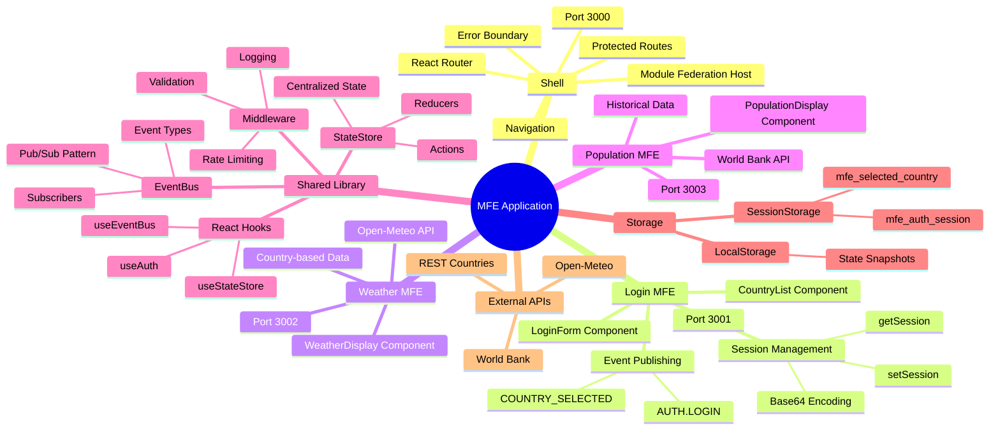
```mermaid
mindmap
  root((MFE Application))
    Shell
      Port 3000
      React Router
      Navigation
      Protected Routes
      Error Boundary
      Module Federation Host
    Login MFE
      Port 3001
      LoginForm Component
      CountryList Component
      Session Management
        setSession
        getSession
        Base64 Encoding
      Event Publishing
        AUTH.LOGIN
        COUNTRY_SELECTED
    Weather MFE
      Port 3002
      WeatherDisplay Component
      Open-Meteo API
      Country-based Data
    Population MFE
      Port 3003
      PopulationDisplay Component
      World Bank API
      Historical Data
    Shared Library
      EventBus
        Pub/Sub Pattern
        Event Types
        Subscribers
      StateStore
        Centralized State
        Actions
        Reducers
      Middleware
        Logging
        Validation
        Rate Limiting
      React Hooks
        useEventBus
        useStateStore
        useAuth
    Storage
      SessionStorage
        mfe_auth_session
        mfe_selected_country
      LocalStorage
        State Snapshots
    External APIs
      REST Countries
      Open-Meteo
      World Bank
```

---

## 17. Technology Stack Mindmap

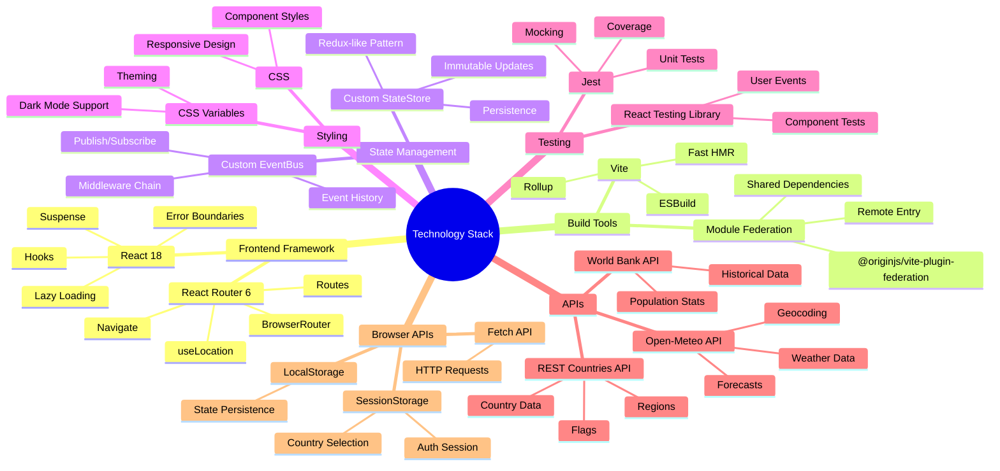
```mermaid
mindmap
  root((Technology Stack))
    Frontend Framework
      React 18
        Hooks
        Suspense
        Lazy Loading
        Error Boundaries
      React Router 6
        BrowserRouter
        Routes
        Navigate
        useLocation
    Build Tools
      Vite
        Fast HMR
        ESBuild
        Rollup
      Module Federation
        @originjs/vite-plugin-federation
        Remote Entry
        Shared Dependencies
    State Management
      Custom EventBus
        Publish/Subscribe
        Event History
        Middleware Chain
      Custom StateStore
        Redux-like Pattern
        Immutable Updates
        Persistence
    Styling
      CSS
        Component Styles
        Responsive Design
      CSS Variables
        Theming
        Dark Mode Support
    Testing
      Jest
        Unit Tests
        Mocking
        Coverage
      React Testing Library
        Component Tests
        User Events
    APIs
      REST Countries API
        Country Data
        Flags
        Regions
      Open-Meteo API
        Weather Data
        Forecasts
        Geocoding
      World Bank API
        Population Stats
        Historical Data
    Browser APIs
      SessionStorage
        Auth Session
        Country Selection
      LocalStorage
        State Persistence
      Fetch API
        HTTP Requests
```

---

## 1. High-Level Architecture Diagram

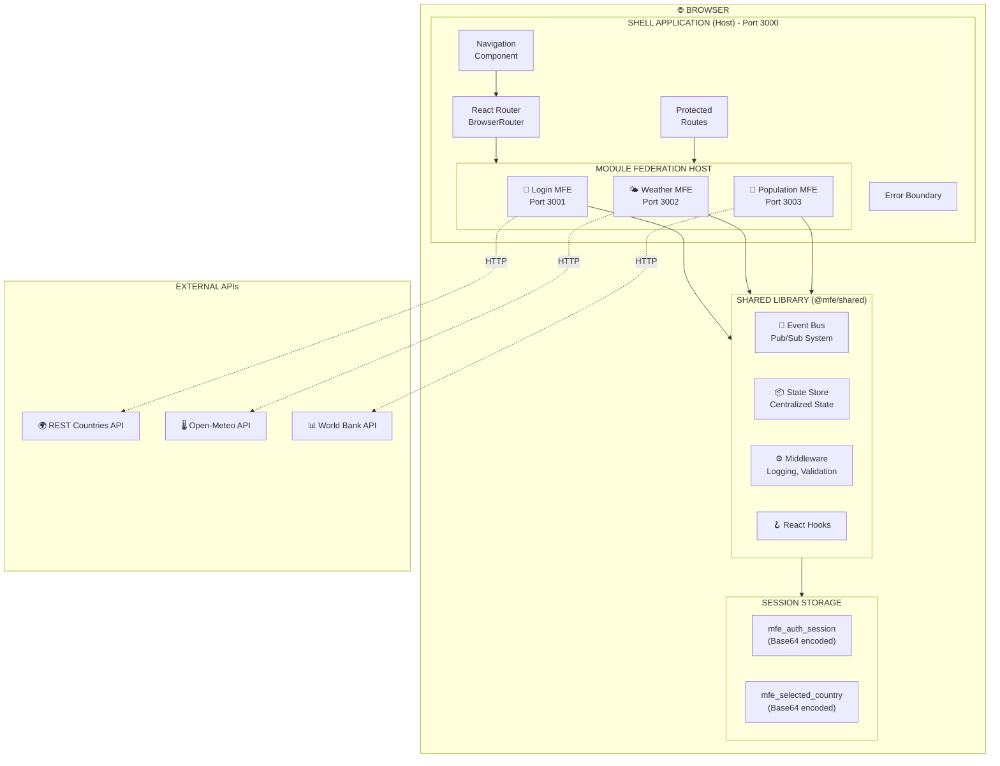
```mermaid
flowchart TB
    subgraph Browser["🌐 BROWSER"]
        subgraph Shell["SHELL APPLICATION (Host) - Port 3000"]
            Router["React Router<br/>BrowserRouter"]
            Nav["Navigation<br/>Component"]
            ErrorBound["Error Boundary"]
            Protected["Protected<br/>Routes"]
            
            subgraph ModFed["MODULE FEDERATION HOST"]
                LoginMFE["🔐 Login MFE<br/>Port 3001"]
                WeatherMFE["🌤️ Weather MFE<br/>Port 3002"]
                PopulationMFE["👥 Population MFE<br/>Port 3003"]
            end
        end
        
        subgraph Shared["SHARED LIBRARY (@mfe/shared)"]
            EventBus["📡 Event Bus<br/>Pub/Sub System"]
            StateStore["📦 State Store<br/>Centralized State"]
            Middleware["⚙️ Middleware<br/>Logging, Validation"]
            Hooks["🪝 React Hooks"]
        end
        
        subgraph Storage["SESSION STORAGE"]
            AuthSession["mfe_auth_session<br/>(Base64 encoded)"]
            CountryData["mfe_selected_country<br/>(Base64 encoded)"]
        end
    end
    
    subgraph APIs["EXTERNAL APIs"]
        RestCountries["🌍 REST Countries API"]
        OpenMeteo["🌡️ Open-Meteo API"]
        WorldBank["📊 World Bank API"]
    end
    
    Router --> ModFed
    Nav --> Router
    Protected --> ModFed
    
    LoginMFE --> Shared
    WeatherMFE --> Shared
    PopulationMFE --> Shared
    
    Shared --> Storage
    
    WeatherMFE -.->|HTTP| OpenMeteo
    PopulationMFE -.->|HTTP| WorldBank
    LoginMFE -.->|HTTP| RestCountries
```

---

## 2. Component Architecture Diagram

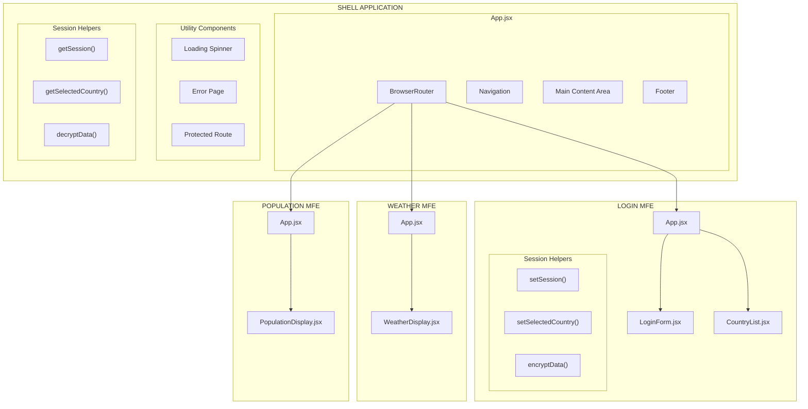
```mermaid
flowchart TB
    subgraph ShellApp["SHELL APPLICATION"]
        subgraph MainApp["App.jsx"]
            BrowserRouter["BrowserRouter"]
            Navigation["Navigation"]
            MainContent["Main Content Area"]
            Footer["Footer"]
        end
        
        subgraph Utilities["Utility Components"]
            Loading["Loading Spinner"]
            ErrorPage["Error Page"]
            ProtectedRoute["Protected Route"]
        end
        
        subgraph SessionHelpers["Session Helpers"]
            getSession["getSession()"]
            getCountry["getSelectedCountry()"]
            decryptData["decryptData()"]
        end
    end
    
    subgraph LoginMFE["LOGIN MFE"]
        LoginApp["App.jsx"]
        LoginForm["LoginForm.jsx"]
        CountryList["CountryList.jsx"]
        
        subgraph LoginHelpers["Session Helpers"]
            setSession["setSession()"]
            setCountry["setSelectedCountry()"]
            encryptData["encryptData()"]
        end
    end
    
    subgraph WeatherMFE["WEATHER MFE"]
        WeatherApp["App.jsx"]
        WeatherDisplay["WeatherDisplay.jsx"]
    end
    
    subgraph PopMFE["POPULATION MFE"]
        PopApp["App.jsx"]
        PopDisplay["PopulationDisplay.jsx"]
    end
    
    BrowserRouter --> LoginApp
    BrowserRouter --> WeatherApp
    BrowserRouter --> PopApp
    
    LoginApp --> LoginForm
    LoginApp --> CountryList
    WeatherApp --> WeatherDisplay
    PopApp --> PopDisplay
```

---

## 3. Module Federation Diagram

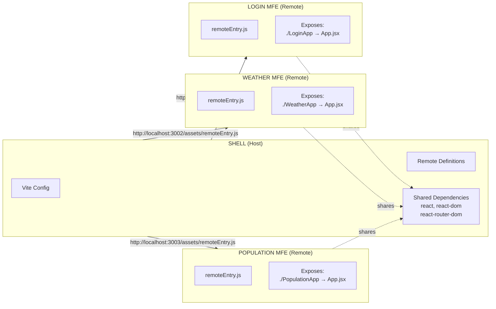
```mermaid
flowchart LR
    subgraph Host["SHELL (Host)"]
        direction TB
        ViteHost["Vite Config"]
        Remotes["Remote Definitions"]
        SharedDeps["Shared Dependencies<br/>react, react-dom<br/>react-router-dom"]
    end
    
    subgraph Remote1["LOGIN MFE (Remote)"]
        direction TB
        LoginEntry["remoteEntry.js"]
        LoginExpose["Exposes:<br/>./LoginApp → App.jsx"]
    end
    
    subgraph Remote2["WEATHER MFE (Remote)"]
        direction TB
        WeatherEntry["remoteEntry.js"]
        WeatherExpose["Exposes:<br/>./WeatherApp → App.jsx"]
    end
    
    subgraph Remote3["POPULATION MFE (Remote)"]
        direction TB
        PopEntry["remoteEntry.js"]
        PopExpose["Exposes:<br/>./PopulationApp → App.jsx"]
    end
    
    Host -->|"http://localhost:3001/assets/remoteEntry.js"| Remote1
    Host -->|"http://localhost:3002/assets/remoteEntry.js"| Remote2
    Host -->|"http://localhost:3003/assets/remoteEntry.js"| Remote3
    
    Remote1 -.->|shares| SharedDeps
    Remote2 -.->|shares| SharedDeps
    Remote3 -.->|shares| SharedDeps
```

---

## 4. Authentication Flow Sequence Diagram

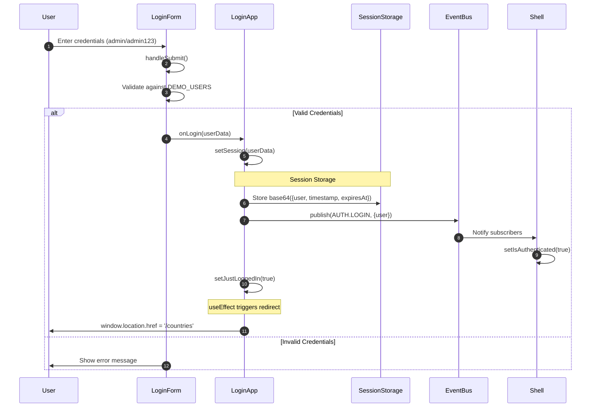
```mermaid
sequenceDiagram
    autonumber
    participant User
    participant LoginForm
    participant LoginApp
    participant SessionStorage
    participant EventBus
    participant Shell
    
    User->>LoginForm: Enter credentials (admin/admin123)
    LoginForm->>LoginForm: handleSubmit()
    LoginForm->>LoginForm: Validate against DEMO_USERS
    
    alt Valid Credentials
        LoginForm->>LoginApp: onLogin(userData)
        LoginApp->>LoginApp: setSession(userData)
        
        Note over LoginApp,SessionStorage: Session Storage
        LoginApp->>SessionStorage: Store base64({user, timestamp, expiresAt})
        
        LoginApp->>EventBus: publish(AUTH.LOGIN, {user})
        EventBus->>Shell: Notify subscribers
        Shell->>Shell: setIsAuthenticated(true)
        
        LoginApp->>LoginApp: setJustLoggedIn(true)
        
        Note over LoginApp: useEffect triggers redirect
        LoginApp->>User: window.location.href = '/countries'
    else Invalid Credentials
        LoginForm->>User: Show error message
    end
```

---

## 5. Session Management Diagram

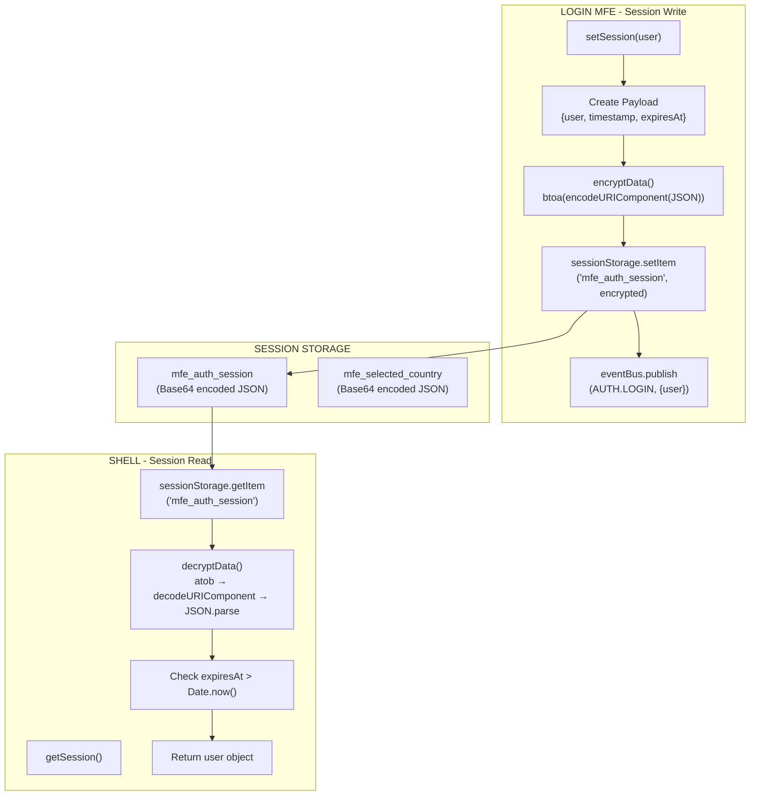
```mermaid
flowchart TB
    subgraph LoginMFE["LOGIN MFE - Session Write"]
        setSession["setSession(user)"]
        createPayload["Create Payload<br/>{user, timestamp, expiresAt}"]
        encode["encryptData()<br/>btoa(encodeURIComponent(JSON))"]
        storeSession["sessionStorage.setItem<br/>('mfe_auth_session', encrypted)"]
        publishLogin["eventBus.publish<br/>(AUTH.LOGIN, {user})"]
    end
    
    subgraph SessionStorage["SESSION STORAGE"]
        authKey["mfe_auth_session<br/>(Base64 encoded JSON)"]
        countryKey["mfe_selected_country<br/>(Base64 encoded JSON)"]
    end
    
    subgraph Shell["SHELL - Session Read"]
        getSession["getSession()"]
        readStorage["sessionStorage.getItem<br/>('mfe_auth_session')"]
        decode["decryptData()<br/>atob → decodeURIComponent → JSON.parse"]
        checkExpiry["Check expiresAt > Date.now()"]
        returnUser["Return user object"]
    end
    
    setSession --> createPayload --> encode --> storeSession
    storeSession --> authKey
    storeSession --> publishLogin
    
    authKey --> readStorage
    readStorage --> decode --> checkExpiry --> returnUser
```

---

## 6. Event Bus Communication Diagram

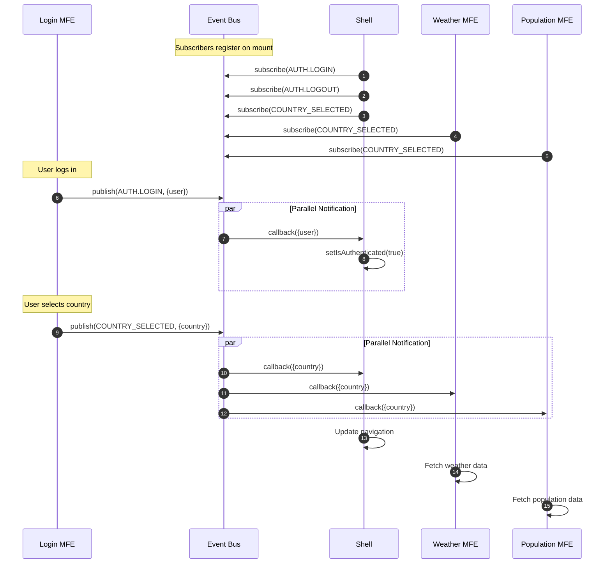
```mermaid
sequenceDiagram
    autonumber
    participant LoginMFE as Login MFE
    participant EventBus as Event Bus
    participant Shell as Shell
    participant WeatherMFE as Weather MFE
    participant PopMFE as Population MFE
    
    Note over EventBus: Subscribers register on mount
    Shell->>EventBus: subscribe(AUTH.LOGIN)
    Shell->>EventBus: subscribe(AUTH.LOGOUT)
    Shell->>EventBus: subscribe(COUNTRY_SELECTED)
    WeatherMFE->>EventBus: subscribe(COUNTRY_SELECTED)
    PopMFE->>EventBus: subscribe(COUNTRY_SELECTED)
    
    Note over LoginMFE: User logs in
    LoginMFE->>EventBus: publish(AUTH.LOGIN, {user})
    
    par Parallel Notification
        EventBus->>Shell: callback({user})
        Shell->>Shell: setIsAuthenticated(true)
    end
    
    Note over LoginMFE: User selects country
    LoginMFE->>EventBus: publish(COUNTRY_SELECTED, {country})
    
    par Parallel Notification
        EventBus->>Shell: callback({country})
        EventBus->>WeatherMFE: callback({country})
        EventBus->>PopMFE: callback({country})
    end
    
    Shell->>Shell: Update navigation
    WeatherMFE->>WeatherMFE: Fetch weather data
    PopMFE->>PopMFE: Fetch population data
```

---

## 7. State Management Diagram

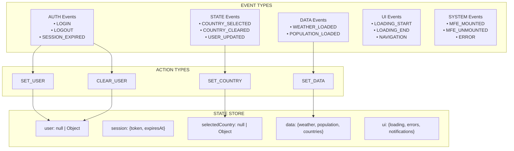
```mermaid
flowchart TB
    subgraph EventTypes["EVENT TYPES"]
        AUTH["AUTH Events<br/>• LOGIN<br/>• LOGOUT<br/>• SESSION_EXPIRED"]
        STATE["STATE Events<br/>• COUNTRY_SELECTED<br/>• COUNTRY_CLEARED<br/>• USER_UPDATED"]
        DATA["DATA Events<br/>• WEATHER_LOADED<br/>• POPULATION_LOADED"]
        UI["UI Events<br/>• LOADING_START<br/>• LOADING_END<br/>• NAVIGATION"]
        SYSTEM["SYSTEM Events<br/>• MFE_MOUNTED<br/>• MFE_UNMOUNTED<br/>• ERROR"]
    end
    
    subgraph StateStore["STATE STORE"]
        User["user: null | Object"]
        Session["session: {token, expiresAt}"]
        Country["selectedCountry: null | Object"]
        Data["data: {weather, population, countries}"]
        UI_State["ui: {loading, errors, notifications}"]
    end
    
    subgraph Actions["ACTION TYPES"]
        SET_USER["SET_USER"]
        CLEAR_USER["CLEAR_USER"]
        SET_COUNTRY["SET_COUNTRY"]
        SET_DATA["SET_DATA"]
    end
    
    AUTH --> SET_USER
    AUTH --> CLEAR_USER
    STATE --> SET_COUNTRY
    DATA --> SET_DATA
    
    SET_USER --> User
    CLEAR_USER --> User
    SET_COUNTRY --> Country
    SET_DATA --> Data
```

---

## 8. Data Flow Diagram

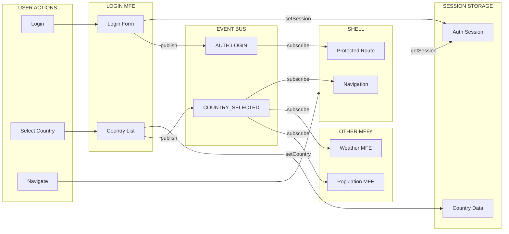
```mermaid
flowchart LR
    subgraph User["USER ACTIONS"]
        Login["Login"]
        SelectCountry["Select Country"]
        Navigate["Navigate"]
    end
    
    subgraph LoginMFE["LOGIN MFE"]
        LoginForm["Login Form"]
        CountryList["Country List"]
    end
    
    subgraph Storage["SESSION STORAGE"]
        AuthSession["Auth Session"]
        CountrySession["Country Data"]
    end
    
    subgraph EventBus["EVENT BUS"]
        AuthLogin["AUTH.LOGIN"]
        CountrySelected["COUNTRY_SELECTED"]
    end
    
    subgraph Shell["SHELL"]
        ProtectedRoute["Protected Route"]
        Navigation["Navigation"]
    end
    
    subgraph OtherMFEs["OTHER MFEs"]
        Weather["Weather MFE"]
        Population["Population MFE"]
    end
    
    Login --> LoginForm
    LoginForm -->|setSession| AuthSession
    LoginForm -->|publish| AuthLogin
    AuthLogin -->|subscribe| ProtectedRoute
    
    SelectCountry --> CountryList
    CountryList -->|setCountry| CountrySession
    CountryList -->|publish| CountrySelected
    CountrySelected -->|subscribe| Navigation
    CountrySelected -->|subscribe| Weather
    CountrySelected -->|subscribe| Population
    
    Navigate --> Shell
    Shell -->|getSession| AuthSession
```

---

## 9. Routing and Navigation Diagram

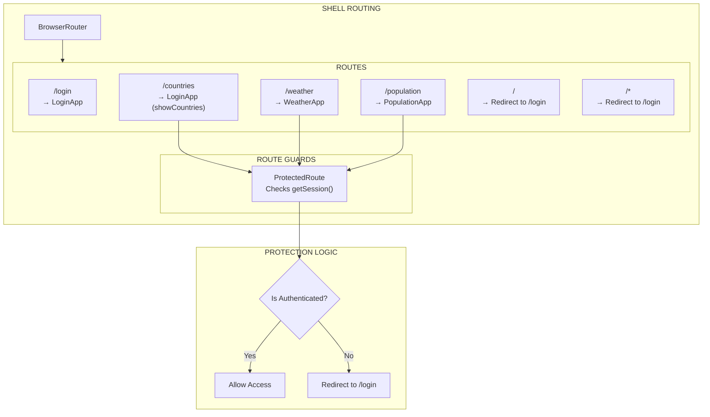
```mermaid
flowchart TB
    subgraph Shell["SHELL ROUTING"]
        BrowserRouter["BrowserRouter"]
        
        subgraph Routes["ROUTES"]
            LoginRoute["/login<br/>→ LoginApp"]
            CountriesRoute["/countries<br/>→ LoginApp (showCountries)"]
            WeatherRoute["/weather<br/>→ WeatherApp"]
            PopRoute["/population<br/>→ PopulationApp"]
            DefaultRoute["/<br/>→ Redirect to /login"]
            CatchAll["/*<br/>→ Redirect to /login"]
        end
        
        subgraph Guards["ROUTE GUARDS"]
            ProtectedRoute["ProtectedRoute<br/>Checks getSession()"]
        end
    end
    
    subgraph Protection["PROTECTION LOGIC"]
        CheckAuth{"Is Authenticated?"}
        AllowAccess["Allow Access"]
        RedirectLogin["Redirect to /login"]
    end
    
    BrowserRouter --> Routes
    
    CountriesRoute --> ProtectedRoute
    WeatherRoute --> ProtectedRoute
    PopRoute --> ProtectedRoute
    
    ProtectedRoute --> CheckAuth
    CheckAuth -->|Yes| AllowAccess
    CheckAuth -->|No| RedirectLogin
```

---

## 10. Error Handling Diagram

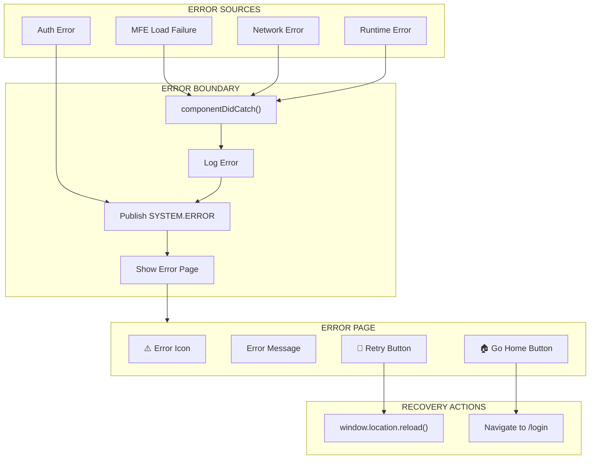
```mermaid
flowchart TB
    subgraph ErrorSources["ERROR SOURCES"]
        MFELoad["MFE Load Failure"]
        NetworkError["Network Error"]
        AuthError["Auth Error"]
        RuntimeError["Runtime Error"]
    end
    
    subgraph ErrorBoundary["ERROR BOUNDARY"]
        Catch["componentDidCatch()"]
        LogError["Log Error"]
        PublishEvent["Publish SYSTEM.ERROR"]
        ShowFallback["Show Error Page"]
    end
    
    subgraph ErrorPage["ERROR PAGE"]
        ErrorIcon["⚠️ Error Icon"]
        ErrorMessage["Error Message"]
        RetryButton["🔄 Retry Button"]
        HomeButton["🏠 Go Home Button"]
    end
    
    subgraph Recovery["RECOVERY ACTIONS"]
        Reload["window.location.reload()"]
        GoHome["Navigate to /login"]
    end
    
    MFELoad --> Catch
    NetworkError --> Catch
    RuntimeError --> Catch
    AuthError --> PublishEvent
    
    Catch --> LogError --> PublishEvent --> ShowFallback
    ShowFallback --> ErrorPage
    
    RetryButton --> Reload
    HomeButton --> GoHome
```

---

## 11. C4 Context Diagram

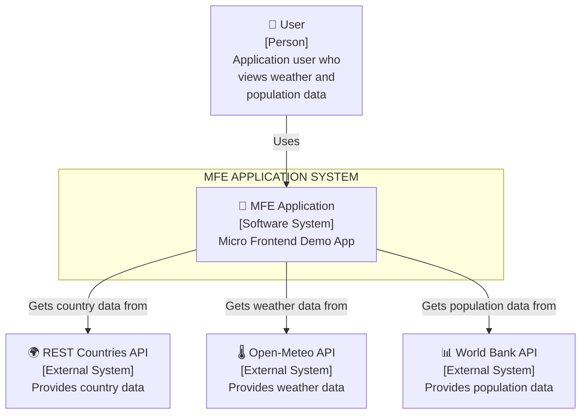
```mermaid
flowchart TB
    subgraph System["MFE APPLICATION SYSTEM"]
        MFEApp["🏢 MFE Application<br/>[Software System]<br/>Micro Frontend Demo App"]
    end
    
    User["👤 User<br/>[Person]<br/>Application user who<br/>views weather and<br/>population data"]
    
    RestCountries["🌍 REST Countries API<br/>[External System]<br/>Provides country data"]
    
    OpenMeteo["🌡️ Open-Meteo API<br/>[External System]<br/>Provides weather data"]
    
    WorldBank["📊 World Bank API<br/>[External System]<br/>Provides population data"]
    
    User -->|"Uses"| MFEApp
    MFEApp -->|"Gets country data from"| RestCountries
    MFEApp -->|"Gets weather data from"| OpenMeteo
    MFEApp -->|"Gets population data from"| WorldBank
```

---

## 12. C4 Container Diagram

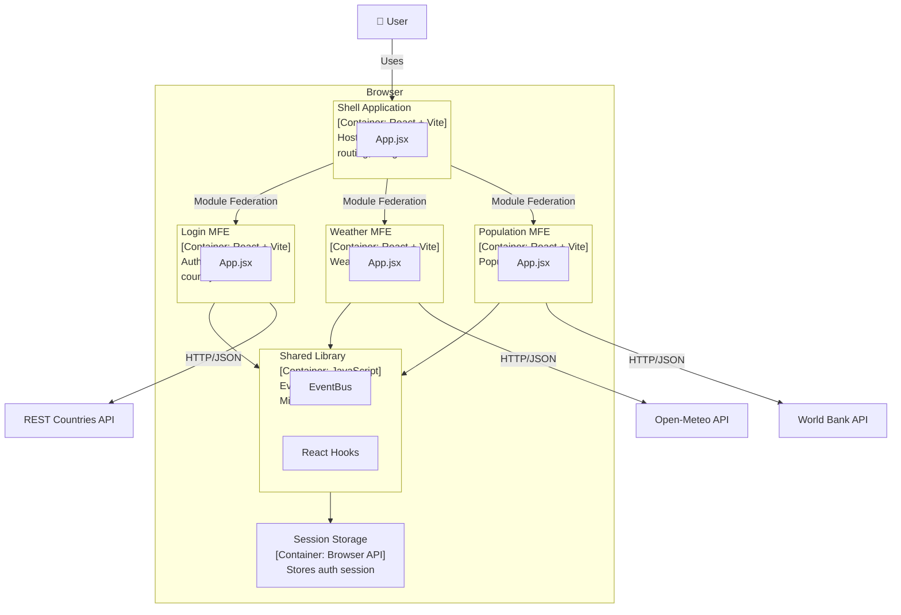
```mermaid
flowchart TB
    User["👤 User"]
    
    subgraph Browser["Browser"]
        subgraph Shell["Shell Application<br/>[Container: React + Vite]<br/>Host application,<br/>routing, navigation"]
            ShellApp["App.jsx"]
        end
        
        subgraph LoginMFE["Login MFE<br/>[Container: React + Vite]<br/>Authentication &<br/>country selection"]
            LoginApp["App.jsx"]
        end
        
        subgraph WeatherMFE["Weather MFE<br/>[Container: React + Vite]<br/>Weather display"]
            WeatherApp["App.jsx"]
        end
        
        subgraph PopMFE["Population MFE<br/>[Container: React + Vite]<br/>Population display"]
            PopApp["App.jsx"]
        end
        
        subgraph SharedLib["Shared Library<br/>[Container: JavaScript]<br/>EventBus, Hooks,<br/>Middleware"]
            EventBus["EventBus"]
            Hooks["React Hooks"]
        end
        
        Storage["Session Storage<br/>[Container: Browser API]<br/>Stores auth session"]
    end
    
    RestCountries["REST Countries API"]
    OpenMeteo["Open-Meteo API"]
    WorldBank["World Bank API"]
    
    User -->|"Uses"| Shell
    Shell -->|"Module Federation"| LoginMFE
    Shell -->|"Module Federation"| WeatherMFE
    Shell -->|"Module Federation"| PopMFE
    
    LoginMFE --> SharedLib
    WeatherMFE --> SharedLib
    PopMFE --> SharedLib
    
    SharedLib --> Storage
    
    LoginMFE -->|"HTTP/JSON"| RestCountries
    WeatherMFE -->|"HTTP/JSON"| OpenMeteo
    PopMFE -->|"HTTP/JSON"| WorldBank
```

---

## 13. Deployment Architecture Diagram

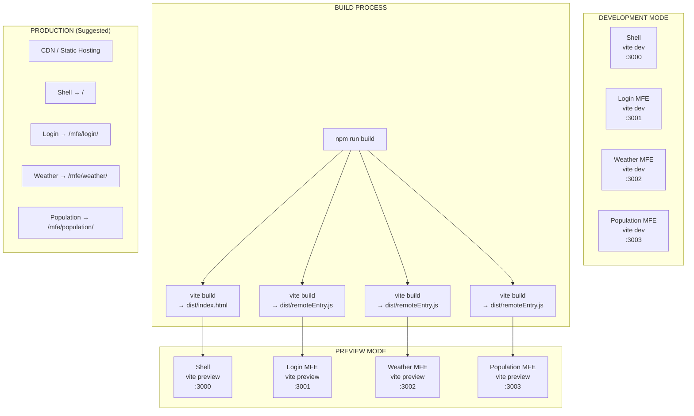
```mermaid
flowchart TB
    subgraph Development["DEVELOPMENT MODE"]
        DevShell["Shell<br/>vite dev<br/>:3000"]
        DevLogin["Login MFE<br/>vite dev<br/>:3001"]
        DevWeather["Weather MFE<br/>vite dev<br/>:3002"]
        DevPop["Population MFE<br/>vite dev<br/>:3003"]
    end
    
    subgraph Build["BUILD PROCESS"]
        BuildCmd["npm run build"]
        BuildLogin["vite build<br/>→ dist/remoteEntry.js"]
        BuildWeather["vite build<br/>→ dist/remoteEntry.js"]
        BuildPop["vite build<br/>→ dist/remoteEntry.js"]
        BuildShell["vite build<br/>→ dist/index.html"]
    end
    
    subgraph Preview["PREVIEW MODE"]
        PreviewShell["Shell<br/>vite preview<br/>:3000"]
        PreviewLogin["Login MFE<br/>vite preview<br/>:3001"]
        PreviewWeather["Weather MFE<br/>vite preview<br/>:3002"]
        PreviewPop["Population MFE<br/>vite preview<br/>:3003"]
    end
    
    subgraph Production["PRODUCTION (Suggested)"]
        CDN["CDN / Static Hosting"]
        ShellProd["Shell → /"]
        LoginProd["Login → /mfe/login/"]
        WeatherProd["Weather → /mfe/weather/"]
        PopProd["Population → /mfe/population/"]
    end
    
    BuildCmd --> BuildLogin
    BuildCmd --> BuildWeather
    BuildCmd --> BuildPop
    BuildCmd --> BuildShell
    
    BuildLogin --> PreviewLogin
    BuildWeather --> PreviewWeather
    BuildPop --> PreviewPop
    BuildShell --> PreviewShell
```

---

## 14. Login MFE Internal Flow

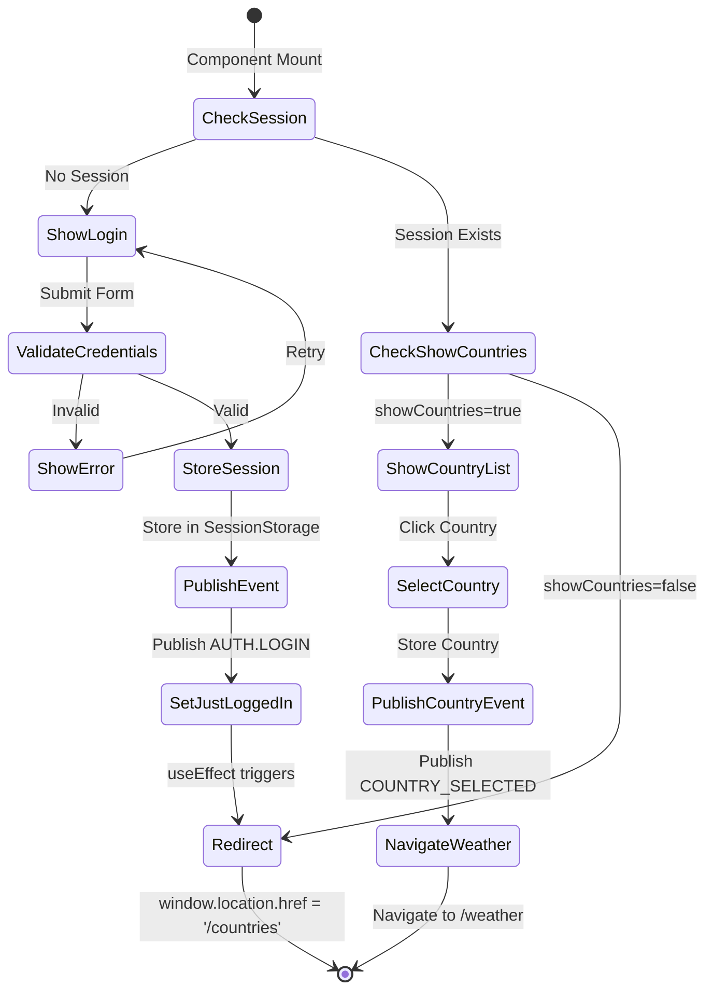
```mermaid
stateDiagram-v2
    [*] --> CheckSession: Component Mount
    
    CheckSession --> ShowLogin: No Session
    CheckSession --> CheckShowCountries: Session Exists
    
    CheckShowCountries --> ShowCountryList: showCountries=true
    CheckShowCountries --> Redirect: showCountries=false
    
    ShowLogin --> ValidateCredentials: Submit Form
    ValidateCredentials --> ShowError: Invalid
    ValidateCredentials --> StoreSession: Valid
    
    ShowError --> ShowLogin: Retry
    
    StoreSession --> PublishEvent: Store in SessionStorage
    PublishEvent --> SetJustLoggedIn: Publish AUTH.LOGIN
    SetJustLoggedIn --> Redirect: useEffect triggers
    
    Redirect --> [*]: window.location.href = '/countries'
    
    ShowCountryList --> SelectCountry: Click Country
    SelectCountry --> PublishCountryEvent: Store Country
    PublishCountryEvent --> NavigateWeather: Publish COUNTRY_SELECTED
    NavigateWeather --> [*]: Navigate to /weather
```

---

## 15. Complete Application Flow

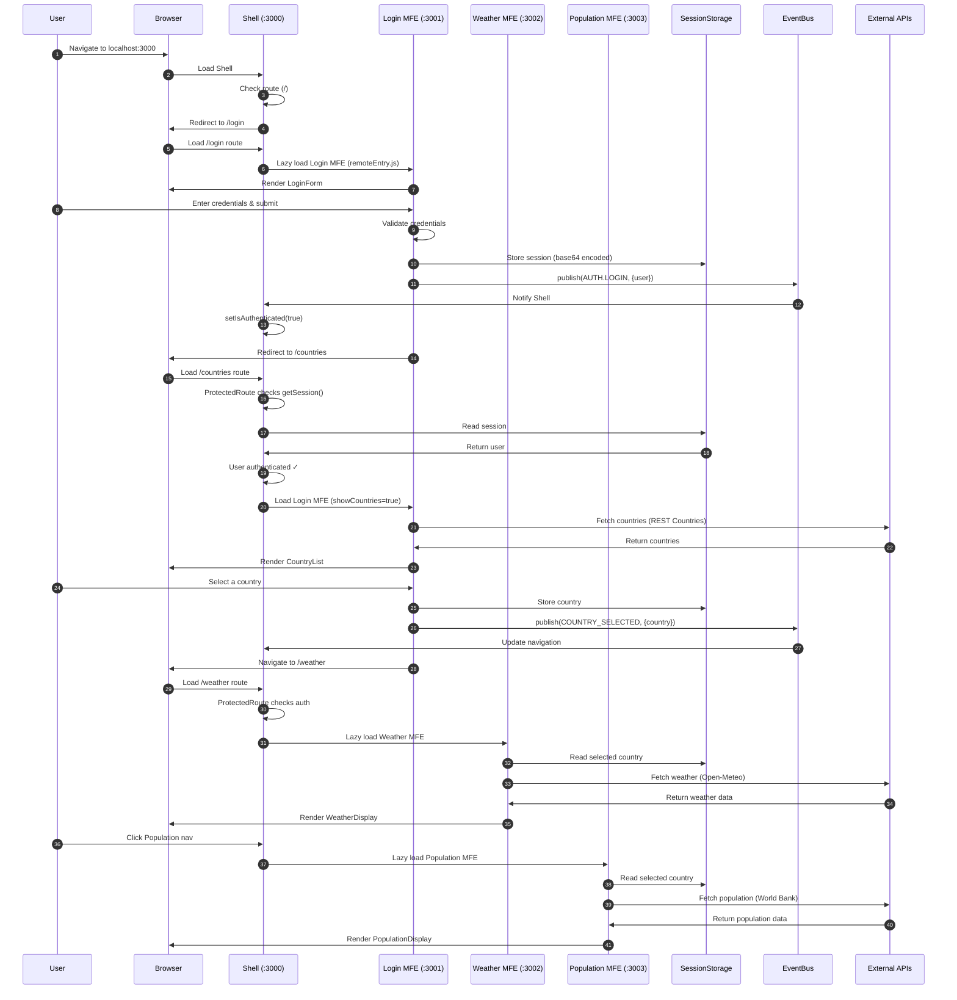
```mermaid
sequenceDiagram
    autonumber
    participant U as User
    participant B as Browser
    participant S as Shell (:3000)
    participant L as Login MFE (:3001)
    participant W as Weather MFE (:3002)
    participant P as Population MFE (:3003)
    participant SS as SessionStorage
    participant EB as EventBus
    participant API as External APIs
    
    U->>B: Navigate to localhost:3000
    B->>S: Load Shell
    S->>S: Check route (/)
    S->>B: Redirect to /login
    
    B->>S: Load /login route
    S->>L: Lazy load Login MFE (remoteEntry.js)
    L->>B: Render LoginForm
    
    U->>L: Enter credentials & submit
    L->>L: Validate credentials
    L->>SS: Store session (base64 encoded)
    L->>EB: publish(AUTH.LOGIN, {user})
    EB->>S: Notify Shell
    S->>S: setIsAuthenticated(true)
    
    L->>B: Redirect to /countries
    B->>S: Load /countries route
    S->>S: ProtectedRoute checks getSession()
    S->>SS: Read session
    SS->>S: Return user
    S->>S: User authenticated ✓
    S->>L: Load Login MFE (showCountries=true)
    L->>API: Fetch countries (REST Countries)
    API->>L: Return countries
    L->>B: Render CountryList
    
    U->>L: Select a country
    L->>SS: Store country
    L->>EB: publish(COUNTRY_SELECTED, {country})
    EB->>S: Update navigation
    L->>B: Navigate to /weather
    
    B->>S: Load /weather route
    S->>S: ProtectedRoute checks auth
    S->>W: Lazy load Weather MFE
    W->>SS: Read selected country
    W->>API: Fetch weather (Open-Meteo)
    API->>W: Return weather data
    W->>B: Render WeatherDisplay
    
    U->>S: Click Population nav
    S->>P: Lazy load Population MFE
    P->>SS: Read selected country
    P->>API: Fetch population (World Bank)
    API->>P: Return population data
    P->>B: Render PopulationDisplay
```

---

## Key Architecture Decisions

### 1. Session Storage Format
- **Format**: Base64 encoded JSON
- **Why**: Simple, browser-compatible, easy to debug
- **Keys**: `mfe_auth_session`, `mfe_selected_country`

### 2. Event Bus for Cross-MFE Communication
- **Pattern**: Pub/Sub
- **Why**: Loose coupling, MFEs don't need to know about each other
- **Events**: AUTH.LOGIN, AUTH.LOGOUT, COUNTRY_SELECTED, etc.

### 3. Module Federation
- **Tool**: @originjs/vite-plugin-federation
- **Why**: Dynamic loading of MFEs at runtime
- **Note**: Requires build before preview (remoteEntry.js only generated during build)

### 4. Protected Routes
- **Implementation**: Shell reads session directly from SessionStorage
- **Why**: Consistent session format between Shell and Login MFE
- **Fallback**: Subscribes to EventBus for real-time updates

---

## Running the Application

```bash
# Development (HMR, but Module Federation won't work)
npm run dev

# Production-like (Module Federation works)
npm run build
npm run preview

# Then open http://localhost:3000
```

**Important**: Module Federation requires `npm run build` before `npm run preview` because `remoteEntry.js` is only generated during the build process.
